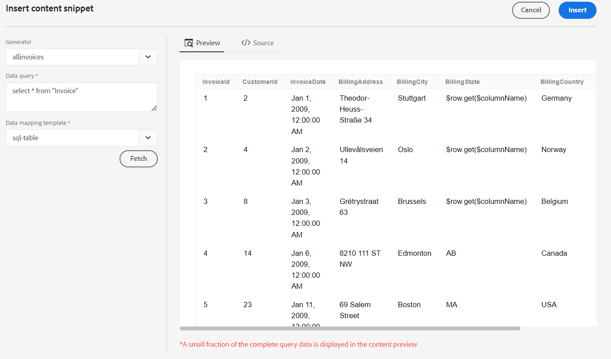

# 데이터 소스에서 콘텐츠 조각 삽입

AEM Guides에서는 데이터 소스와 연결하는 기능을 제공합니다. 데이터를 가져와 주제에 삽입하고 편집할 수 있습니다. 콘텐츠 조각 생성기를 사용하여 콘텐츠 조각을 쉽게 만들고 주제 내에서 재사용할 수 있습니다.

콘텐츠 조각 생성기를 사용하여 콘텐츠 조각을 만들고 항목에 삽입하려면 다음 단계를 수행하십시오.

1. 선택 **데이터 소스**    왼쪽 패널에서 연결된 데이터 소스를 볼 수 있습니다. 데이터 소스 패널이 열리고 연결된 모든 데이터 소스가 표시됩니다. 자세한 내용은 [데이터 소스 커넥터 구성](../cs-install-guide/conf-data-source-connector.md).
   >[!NOTE]
   >
   > 관리자가 커넥터를 구성한 데이터 소스가 표시됩니다.

1. 선택한 데이터 소스에 사용할 수 있는 콘텐츠 조각 생성기를 보려면 데이터 소스를 선택하십시오.
   {width="300" align="left"}
1. 선택 **추가** 새 콘텐츠 조각 생성기를 추가합니다. 다음 **콘텐츠 조각 생성기 추가** 패널이 열립니다.

1. 데이터 쿼리 텍스트 상자에 쿼리를 입력합니다.
1. 에서 데이터 소스와 매핑할 템플릿을 선택합니다. **데이터 매핑 템플릿** 드롭다운입니다.
선택한 데이터 소스에 대한 기본 제공 템플릿이 드롭다운에 표시됩니다. 예를 들어 &quot;PostgreSQL&quot; 데이터 소스의 &quot;sql-table&quot; 템플릿을 볼 수 있습니다.

   >[!NOTE]
   >  
   > 관리자가 사용자 정의된 템플릿을 구성하면 관리자가 수행한 템플릿 경로 구성에 따라 드롭다운 목록에도 해당 템플릿이 표시됩니다.

1. 클릭 **가져오기** 을 눌러 데이터 소스에서 데이터를 가져오고 SQL 쿼리의 결과로 생성되는 데이터에 템플릿을 적용합니다.
1. 미리보기 또는 DITA 소스 뷰에서 데이터를 볼 수 있습니다.

   1. 미리보기는 콘텐츠에 삽입할 때 데이터가 표시되는 방식을 보여 줍니다. 미리 보기에는 데이터의 작은 부분이 선택한 템플릿의 형식으로 표시됩니다.
예:
      * SQL 테이블 템플릿을 선택한 경우 SQL 데이터를 테이블 형식으로 볼 수 있습니다.
      * jira 순차 목록 템플릿을 선택한 경우 Jira 문제에 대한 순차 목록을 볼 수 있습니다.

   1. 소스 뷰에는 DITA 소스 뷰의 데이터가 표시됩니다.
      {width="800" align="left"}
1. 쿼리 결과를 저장하려면 생성자의 이름을 입력한 다음 을 클릭합니다 **추가**.   새 콘텐츠 조각 생성기가 목록에 추가됩니다.

   >[!NOTE]
   >
   > 새 콘텐츠 생성기의 이름에 대한 파일 이름 지정 규칙을 따라야 합니다. 콘텐츠 조각 생성기 이름에는 공백을 사용할 수 없습니다. 또한 기존 컨텐츠 생성기의 이름으로 새 컨텐츠 생성기를 저장할 수 없습니다. 오류가 발생했습니다.

## 콘텐츠 조각 생성기 옵션

콘텐츠 조각 생성기를 마우스 오른쪽 단추로 클릭하여 옵션을 엽니다. 옵션을 사용하여 다음 작업을 수행할 수 있습니다.
* **삽입**: 이 옵션을 사용하여 선택한 콘텐츠 스니펫을 웹 편집기에서 편집하기 위해 연 항목에 삽입합니다. 데이터가 코드 조각으로 삽입되면 웹 편집기에서 주제 내의 데이터를 편집할 수도 있습니다.

  >[!NOTE]
  > 
  > 삽입 옵션은 항목을 편집하는 동안에만 나타납니다.

* **편집**: 이 옵션을 사용하여 콘텐츠 조각 생성기를 변경하고 저장합니다.
* **삭제**: 이 옵션을 사용하여 선택한 콘텐츠 조각 생성기를 삭제합니다.
* **복제**: 이 옵션을 사용하여 선택한 콘텐츠 조각 생성기의 복제본 또는 사본을 만듭니다. 복제본은 기본적으로 접미사(예: generator_1)로 생성됩니다.

### 쿼리 코드 조각 삽입

다음을 사용할 수도 있습니다 **쿼리 코드 조각 삽입**    을 클릭하여 데이터 스니펫을 주제에 삽입합니다.  드롭다운에서 생성기를 선택하거나 쿼리를 편집하거나 템플릿을 변경하고 주제에 데이터를 삽입할 수 있습니다.

{width="800" align="left"}

