# 웹 편집기 기능 알아보기 {#id176NC500V5Z}

이 섹션에서는 웹 편집기에서 사용할 수 있는 다양한 기능을 안내합니다. 웹 편집기를 다음 섹션 또는 영역으로 나눌 수 있습니다.

- [기본 도구 모음](#id2051EA0G05Z)
- [보조 도구 모음](#id2051EA0J0Y4)
- [왼쪽 패널](#id2051EA0M0HS)
- [콘텐츠 편집 영역](#id2051EB000UI)
- [오른쪽 패널](#id2051EB003YK)

다음 하위 섹션은 웹 편집기의 다양한 섹션에 대해 자세히 설명합니다.

## 기본 도구 모음 {#id2051EA0G05Z}

기본 도구 모음은 웹 편집기 인터페이스 맨 위에 있으며, 웹 편집기에서 사용할 수 있는 파일 수준 기능과 다양한 작성 모드를 제공합니다. 상단 도구 모음에서 사용할 수 있는 기능은 다음과 같이 설명되어 있습니다.

**모두 저장** - 

열려 있는 모든 주제에 변경한 내용을 저장합니다. 웹 편집기에서 열려 있는 항목이 여러 개 있는 경우 **모두 저장** 또는 **Crtl**+**S** 바로 가기 키는 한 번의 클릭으로 모든 문서를 저장합니다. 각 문서를 개별적으로 저장할 필요는 없습니다.

>[!NOTE]
>
> 저장 작업으로 인해 항목의 새 버전이 만들어지지 않습니다. 새 버전을 만들려면 [새 버전으로 저장]을 선택합니다.

**새 버전으로 저장** - 

주제의 변경 사항을 저장하고 주제의 새 버전을 만듭니다. 새로 만든 항목에서 작업하는 경우 버전 정보가 다음과 같이 표시됩니다 **없음**.

{width="800" align="left"}

버전 번호는 항목이나 맵 파일에 대해 새로 만들어지는 모든 버전에서 변경됩니다.

을 사용하여 주제나 맵을 저장하도록 선택하는 경우 **새 버전으로 저장**, 다음 대화 상자가 나타납니다.

{width="300" align="left"}

변경 내용을 식별할 주석 및 버전 레이블을 입력하고 **저장** 파일의 새 버전을 만들려면

을(를) 선택하는 경우 *새 버전으로 저장*&#x200B;의 첫 번째 버전은 DAM에서 만들어지며, 여기에서 현재 항목의 활성 버전도 됩니다. 나중에 이전 버전의 주제로 되돌리는 경우 해당 주제의 현재 활성 버전이 됩니다.

관리자가 사전 구성된 버전 레이블이 있는 경우 드롭다운 목록에 해당 레이블이 표시됩니다. 사용 가능한 레이블 목록에서 레이블을 선택하고 문서를 저장할 수 있습니다.

{width="300" align="left"}

항목을 저장할 때 주제의 변경 사항을 지정하는 주석을 추가할 수 있습니다. 이 주석은 항목의 버전 기록에 표시됩니다.

주제가 검토 중인 경우 검토자가 최신 버전의 주제를 사용할 수 있다는 알림을 받게 됩니다. 최신 버전의 문서에 쉽게 액세스하고 최신 버전의 주제를 계속 검토할 수 있습니다.

포인터를 주제 제목 위에 두면 파일 경로 및 버전 번호가 표시됩니다.

{width="800" align="left"}

>[!NOTE]
>
> 주제 버전을 사용할 수 있으면 주제에 레이블을 추가할 수도 있습니다. 그런 다음 특정 버전의 문서를 게시하기 위한 기준선을 만드는 데 이러한 레이블을 사용할 수 있습니다. 주제의 레이블 사용에 대한 자세한 내용은 [레이블 사용](web-editor-use-label.md#).

**실행 취소 및 다시 실행** -  / 

마지막 작업을 실행 취소하거나 재실행합니다.

**요소 삭제** - 

현재 선택한 요소 또는 커서가 위치한 요소를 삭제합니다.

**찾기 및 바꾸기** - 

찾기 및 바꾸기 기능은 작성자 및 소스 보기 모드에서 사용할 수 있습니다. 찾기 및 바꾸기 텍스트 막대가 주제 편집 영역 하단에 나타납니다. 바로 가기 키를 사용할 수 있습니다 **CTRL**+**F** 찾기 및 바꾸기 막대를 호출하려면

{width="800" align="left"}

설정 아이콘 \( 사용\), **대/소문자 무시** 및 **단어 단위로** 검색 옵션. 대/소문자를 구분하지 않는 검색을 수행하려면 **대/소문자 무시** 선택 사항입니다. 그렇지 않으면 대/소문자를 구분하는 검색을 수행하려면 **대/소문자 무시** 선택 사항입니다. 단어 전체를 검색하도록 선택할 수도 있습니다.

검색은 즉시 사용됩니다. 즉, 검색 구문이나 단어를 **찾기** 필드에서 해당 용어가 즉시 검색되어 주제에서 선택됩니다. 마찬가지로 주제의 텍스트를 바꾸려면 각 필드에 검색어와 해당 공백을 입력한 다음 **바꾸기** 또는 **모두 바꾸기** 버튼을 클릭합니다.

소스 보기에서 찾기 및 바꾸기는 특정 요소 또는 속성을 검색하는 데 매우 유용합니다. 예를 들어 `@product` 속성을 소스 보기에서 쉽게 수행할 수 있습니다. 작성자 보기에서는 속성이나 요소를 기반으로 검색할 수 없습니다. 그러나 를 사용하는 동안에는 주의해야 합니다 **모두 바꾸기** XML 코드를 덮어쓸 수 있습니다.

**편집기 설정** - 

편집기 설정은 관리자 사용자만 사용할 수 있습니다. 관리자는 기본 설정을 사용하여 다음 설정을 구성할 수 있습니다.

>[!NOTE]
>
> 기본 설정을 업데이트하는 경우 변경 사항을 적용하려면 문서를 다시 열어야 합니다.

- **일반**: 일반 설정을 사용하면 웹 편집기에서 사용할 사전을 구성할 수 있습니다. 이 탭에는 다음 세 개의 섹션이 포함되어 있습니다. **맞춤법 검사**, **조건**, 및 **작성**.

   {width="650" align="left"}

   - **맞춤법 검사**: 두 가지 옵션이 있습니다. **AEM 맞춤법 검사** 및 **브라우저 맞춤법 검사**. 기본적으로 편집기에서는 브라우저 맞춤법 검사 기능을 사용합니다. 이 맞춤법 검사는 브라우저의 빌드 내 사전을 사용하여 수행됩니다. AEM 맞춤법 검사로 전환하여 AEM 사전을 사용할 수 있으며, 사용자 지정 단어 목록을 추가하도록 사용자 지정할 수도 있습니다. AEM 사전 사용자 지정에 대한 자세한 내용은 *AEM 기본 사전 사용자 지정* 섹션을 참조하십시오.


   - **조건**

      - **작성자 보기에서 조건부 텍스트 강조 표시**: 작성자 보기에서 조건부 텍스트를 강조 표시하려면 이 옵션을 선택합니다. 조건에 대해 정의된 색상을 사용하여 조건부 콘텐츠가 강조 표시됩니다.

      - **조건 속성을 사용한 유효성 검사**: 속성에 대해 정의된 값의 유효성을 검사하려면 이 옵션을 선택합니다. 따라서 잘못된 값을 추가할 수 없습니다.

      - **제목 체계 패널에서 제목과 함께 키 표시**: 제목 체계에서 제목과 함께 키를 표시하려면 이 옵션을 선택합니다. 이 옵션을 선택하지 않으면 제목만 표시됩니다. 예를 들어 &#39;os&#39;, &#39;audience&#39; 및 &#39;other&#39; 값도 제목과 함께 표시됩니다.

         {width="550" align="left"}

      - **조건 패널에 제목 체계 표시**: 조건 패널에서 제목 체계를 보려면 이 옵션을 선택합니다. 이 옵션을 선택 취소하면 정의된 조건이 조건 패널에 표시됩니다.
   - **작성**

      - **모두 바꾸기 활성화**: [찾기 및 바꾸기] 패널에서 [모두 바꾸기] 아이콘을 보려면 이 아이콘을 선택합니다.


**패널**: 이 설정은 편집기의 왼쪽 패널에 표시되는 패널을 제어합니다. 스위치를 전환하여 원하는 패널을 표시하거나 숨길 수 있습니다.

{width="650" align="left"}

>[!NOTE]
>
> 사용자 지정 패널이 구성된 경우 패널 목록에도 표시됩니다. 스위치를 전환하여 사용자 지정 패널을 표시하거나 숨길 수 있습니다. 구성에 대한 자세한 내용은 *왼쪽 패널에서 사용자 지정 패널 구성* 섹션을 참조하십시오.

- **요소 목록**: 관리자는 [요소 삽입](#id204SG30105Z) 팝업을 수행하고 요소에 대한 표시 이름을 정의합니다. 요소 목록 설정을 사용하면 요소의 이름을 DITA 사양에 따라 지정하고 DITA 정의 요소 이름 대신 사용할 레이블을 지정할 수 있습니다.

   {width="650" align="left"}

위의 스크린샷에서는 `b` 요소에 Bold, `codeblock` 에는 일부 다른 요소와 함께 코드 블록의 레이블이 지정됩니다. 을(를) 선택하는 경우 **위의 요소만 사용** 옵션을 선택하면 [요소 삽입] 팝업에는 이 목록에 있는 \(현재 삽입 지점\)의 유효한 요소만 표시됩니다.

다음 스크린샷에서는 이전 스크린샷의 구성된 요소 4개 중 3개만 현재 컨텍스트에 표시됩니다.

{width="300" align="left"}

- **속성 목록**: 요소 목록과 유사하게 요소의 속성 목록에 표시할 속성 및 해당 표시 이름 목록을 제어할 수 있습니다. 다음 스크린샷에서는 요소의 속성 목록에 3개의 속성만 표시되도록 구성되었습니다.

{width="650" align="left"}

이 설정을 사용하여 요소에 속성을 추가하려고 하면 목록에 구성된 속성 목록만 표시됩니다.

{width="300" align="left"}

- **속성 표시**: 속성 목록처럼 요소의 속성 목록에 표시할 속성 목록을 제어할 수 있습니다. 기본적으로 4개 **속성 표시** — 대상, 플랫폼, 제품 및 prop이 요소의 속성 목록에 표시되도록 구성되었습니다. 를 사용하여 표시 속성을 추가할 수도 있습니다 **추가** 아이콘을 클릭합니다. 를 사용하여 표시 속성을 삭제할 수도 있습니다 **삭제** 아이콘.

요소에 대해 정의된 속성이 레이아웃 및 개요 보기에 표시됩니다.

{width="550" align="left"}

- **번역**: 이 탭에는 소스 레이블을 대상 버전에 전파하는 옵션이 포함되어 있습니다.

   - **대상 버전에 소스 버전 레이블 전파**: 번역된 파일에 소스 파일 버전의 레이블을 전달하려면 이 옵션을 선택합니다. 기본적으로 비활성화되어 있습니다.

   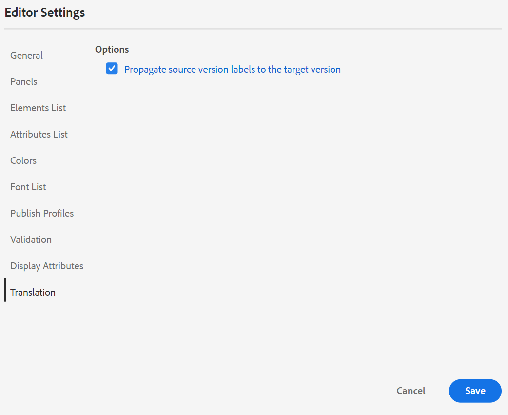{width="550" align="left"}


**사용자 환경 설정** - 

사용자 환경 설정은 모든 작성자가 사용할 수 있습니다. 작성자는 환경 설정을 사용하여 다음 설정을 구성할 수 있습니다.

{width="550" align="left"}

- **테마**: 편집기의 [밝은 영역], [밝은 영역], [어두운] 또는 [어두운] 테마 중에서 선택할 수 있습니다. 가장 밝은 테마의 경우 도구 모음과 패널에서 더 밝은 회색 배경색을 사용합니다. [밝은 테마]의 경우 도구 모음과 패널에서는 밝은 회색 배경색을 사용합니다. 가장 어두운 테마의 경우 도구 모음과 패널에서는 더 어두운 검정색 배경색을 사용합니다. 어두운 테마의 경우 도구 모음과 패널에서는 검정색 배경색을 사용합니다. 모든 테마에 컨텐츠 편집 영역이 흰색 배경색으로 표시됩니다.

- **폴더 프로필**: 폴더 프로필은 조건부 속성, 작성 템플릿, 출력 사전 설정 및 웹 편집기 구성과 관련된 다양한 구성을 제어합니다. 기본적으로 글로벌 프로필이 표시됩니다. 또한 관리자가 시스템에서 폴더 프로파일을 구성한 경우 해당 폴더 프로필이 폴더 프로파일 목록에도 표시됩니다.

   관리자가 폴더 프로필에 정의할 수 있는 웹 편집기의 구성은 다음과 같습니다. 도구 모음 아이콘, 웹 편집기의 레이아웃, 코드 조각 및 루트 맵을 포함하는 사용자 인터페이스 사용자 정의. 자세한 내용은 *글로벌 또는 폴더 수준 프로필 구성* 를 클릭하여 Adobe Experience Manager 안내서 설치 및 구성 as a Cloud Service으로 섹션을 참조하십시오.

   >[!NOTE]
   >
   > 현재 폴더 프로필의 이름은 기본 도구 모음에서 사용자 환경 설정 아이콘의 레이블로 표시됩니다.

- **기본 경로**: 기본적으로 웹 편집기에서 AEM 저장소에 액세스하면 /content/dam 위치에 자산이 표시됩니다. 작업 폴더는 /content/dam/ 폴더 내에 있는 몇 개의 폴더일 수 있습니다. 몇 번의 클릭으로 작업 폴더에 도달할 수 있습니다. 작업 폴더로 기본 경로를 설정하고 저장소 보기를 사용하여 해당 위치의 컨텐츠를 미리 볼 수 있습니다. 이렇게 하면 작업 폴더에 액세스하는 시간이 줄어듭니다. 또한 항목에 참조나 미디어 파일을 삽입하면 파일 찾아보기 위치는 기본 경로에 설정된 폴더로 시작됩니다.

- **루트 맵 선택**: 주요 참조 또는 용어집 항목을 확인할 DITA 맵 파일을 선택합니다. 선택한 루트 맵이 키 참조를 확인하는 가장 높은 우선 순위를 갖습니다. 자세한 내용은 [주요 참조 확인](map-editor-other-features.md#id176GD01H05Z).


>[!NOTE]
>
> 루트 맵을 사용하지 않으려면 **루트 맵 선택** 필드가 비어 있습니다.

**작성자, 소스 및 미리 보기 모드**

다양한 작성 및 문서 보기 모드에 대한 자세한 내용은 [웹 편집기 보기](web-editor-views.md#).

## 보조 도구 모음 {#id2051EA0J0Y4}

웹 편집기에서 편집할 항목을 열면 보조 도구 모음이 나타납니다. 보조 도구 모음에서 사용할 수 있는 기능은 다음과 같이 설명되어 있습니다.

**요소 삽입** - 

현재 또는 다음 유효한 위치에 유효한 요소를 삽입합니다. 와 같은 블록 요소 내에서 작업하는 경우 `note`를 클릭한 다음 요소 삽입 아이콘을 사용하여 `note` 요소를 생성하지 않습니다. 다음 스크린샷에서는 p \(paragraph\) 요소 내에 참고 요소가 삽입되었습니다.

{width="800" align="left"}

메모 요소에서 Enter 키를 누르면 메모 요소 자체 내에 새 단락이 만들어집니다. 참고 외부에 새 요소를 삽입하려면 요소 탐색 경로에서 p 요소 \(스크린샷\)를 클릭하고 요소 삽입 아이콘을 클릭하거나 키를 누릅니다 ***Alt***+***Enter 키*** 요소 삽입 팝업을 열려면 다음을 수행하십시오. 그런 다음 원하는 요소를 선택하고 Enter 키를 눌러 메모 요소 뒤에 선택한 요소를 삽입합니다.

깜박이는 블록 커서가 표시될 때 두 요소 사이에 요소를 추가할 수도 있습니다.

{width="300" align="left"}

예를 들어, DITA 주제에서 작업하고 짧은 설명과 본문 사이에 블록 커서가 깜박이는 경우 추가할 수 있습니다 `prolog` 요소를 만든 다음 저작권, 작성자 및 기타 세부 정보를 추가합니다.

새 요소를 입력하는 또 다른 방법은 컨텍스트 메뉴를 사용하는 것입니다. 문서의 아무 곳이나 마우스 오른쪽 단추로 클릭하여 컨텍스트 메뉴를 호출합니다. 이 메뉴에서 요소 삽입 을 선택하여 요소 삽입 대화 상자를 표시하고 삽입할 요소를 선택합니다.

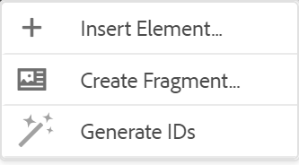{width="300" align="left"}

**단락 삽입** - 

현재 또는 다음 유효한 위치에 단락 요소를 삽입합니다.

**번호 목록 삽입/제거** - 

현재 또는 다음 유효한 위치에 번호 매기기 목록을 만듭니다. 번호 목록에 있고 이 아이콘을 클릭하면 항목이 일반 단락으로 변환됩니다.

**글머리 기호 목록 삽입/제거** - 

현재 또는 다음 유효한 위치에 글머리 기호 목록을 만듭니다. 글머리 기호 목록을 사용하고 이 아이콘을 클릭하면 항목이 일반 단락으로 변환됩니다.

**표 삽입** - 

현재 또는 다음 유효한 위치에 표를 삽입합니다. 표 삽입 아이콘을 클릭하여 표 삽입 대화 상자를 엽니다.

{width="550" align="left"}

테이블에 필요한 행 및 열 수를 지정할 수 있습니다. 첫 번째 행을 테이블 헤더로 유지하려면 첫 번째 행을 헤더로 설정 옵션을 선택합니다. 표에 제목을 추가하려면 제목 필드에 입력합니다.

테이블이 삽입되면 컨텍스트 메뉴를 사용하여 테이블을 수정할 수 있습니다.

{width="550" align="left"}

테이블의 컨텍스트 메뉴를 사용하여 다음을 수행할 수 있습니다.

- 셀, 행 또는 열 삽입

- 셀을 오른쪽 및 아래 방향으로 병합

- 셀을 가로 또는 세로 분할

- 셀, 행 또는 열 삭제

- 테이블에서 코드 조각 만들기

- ID 생성


테이블의 여러 셀, 전체 행 또는 열에 속성을 정의할 수도 있습니다. 예를 들어 테이블 셀을 정렬하려면 필요한 셀을 드래그하여 선택합니다. 컨텐츠 속성 패널 \(오른쪽\)에서 속성 **유형** 변경 사항 **여러 항목**. 기타 속성 섹션에서 `@valign` 속성 드롭다운 목록의 속성. 값 드롭다운 목록에서 선택한 표 셀에 적용할 원하는 텍스트 정렬을 선택합니다.

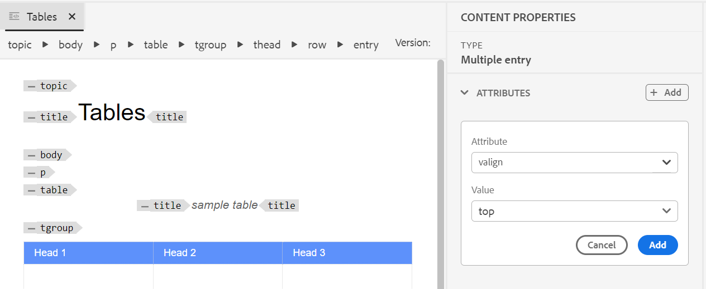{width="800" align="left"}

**이미지 삽입** - 

현재 또는 다음 유효한 위치에 이미지를 삽입합니다. 이미지 삽입 아이콘을 클릭하여 이미지 삽입 대화 상자를 연 다음 삽입할 이미지를 검색하고 선택합니다.

>[!NOTE]
>
> 이미지를 로컬 시스템에서 문서에 끌어다 놓아 추가할 수도 있습니다. 이 경우 를 사용하여 이미지 파일을 추가합니다 **자산 업로드** 워크플로우.  자세한 내용은 **자산 업로드** 의 워크플로우 [왼쪽 패널](web-editor-features.md#id2051EA0M0HS) 섹션을 참조하십시오.


{width="650" align="left"}

이미지 삽입 대화 상자에서 이미지에 대한 이미지/그림 제목 및 대체 텍스트를 추가할 수 있습니다.

맨 위에 있는 검색 유형 표시줄에 파일 이름을 입력하여 필요한 이미지 파일을 검색하고, 검색 결과를 경로 \(검색할 위치\), 컬렉션, 파일 유형 및 태그별로 필터링할 수도 있습니다. 필요한 이미지 파일을 찾으면 파일을 선택하고 선택 을 클릭하여 문서에 이미지를 삽입합니다. 다음과 같은 다양한 형식의 이미지 파일을 삽입할 수 있습니다 `.png`, `.svg`, `.gif`, `.jpg`, `.eps`, `.ai`, `.psd`, 등.

이미지를 삽입한 후에는 [컨텐츠 속성] 패널에서 높이, 너비, 배치 및 속성을 변경할 수 있습니다. 이미지 파일을 클릭한 다음 오른쪽 레일의 컨텐츠 속성 패널에서 변경 작업을 수행합니다.

{width="800" align="left"}

소스 필드에는 삽입된 이미지 파일의 UUID가 표시됩니다. 소스 필드 위로 마우스 포인터를 가져가면 삽입된 이미지 파일의 전체 경로를 찾을 수 있습니다. 경로가 도구 설명에 표시됩니다.

이미지 파일의 높이 또는 너비 값을 제공하여 이미지 크기를 조정할 수 있습니다. 이미지의 종횡비는 자동으로 유지됩니다. 원할 경우 [종횡비 유지]의 잠금 아이콘 \(종횡비 유지\)을 클릭하고 높이 및 너비 값을 제공하여 이미지 파일의 종횡비를 유지하지 않도록 선택할 수도 있습니다.

이미지에 대한 배치 설정을 인라인 또는 브레이크로 지정할 수도 있습니다. 배치 브레이크 옵션을 사용하도록 선택하는 경우 이미지를 정렬할 위치(왼쪽, 가운데 또는 오른쪽\)를 선택할 수 있습니다.

에서 필요한 속성을 선택하여 이미지 파일에 대한 다른 속성을 추가할 수도 있습니다 **속성** 필드.

>[!NOTE]
>
>이미지에 클릭 가능한 영역 \(이미지 맵\)을 정의할 수도 있습니다. 자세한 내용은 **이미지 맵 삽입/편집** 의 기능 설명 [왼쪽 패널](web-editor-features.md#id2051EA0M0HS) 섹션을 참조하십시오.

**이미지 또는 미디어 파일에 대한 컨텍스트 메뉴**

컨텍스트 메뉴를 사용하여 이미지 및 미디어 파일에 대한 몇 가지 일반적인 작업을 수행할 수도 있습니다. 이미지의 아무 곳이나 마우스 오른쪽 단추로 클릭하여 컨텍스트 메뉴를 호출합니다.

컨텍스트 메뉴에서는 이미지나 미디어를 잘라내기, 복사 또는 붙여넣는 옵션을 제공합니다. 선택한 요소의 앞이나 뒤에 요소를 삽입할 수 있습니다. 요소의 이름을 바꾸거나 래핑을 취소할 수 있는 옵션이 있습니다. 저장소에서 선택한 이미지나 미디어를 찾거나 Assets UI에서 파일 미리 보기를 볼 수 있습니다.

컨텍스트 메뉴의 다른 옵션을 사용하여 경로를 복사하거나, 이미지 맵을 편집하거나, 코드 조각을 만들거나, 선택한 요소에 대한 ID를 생성할 수 있습니다.

**멀티미디어 삽입** - 

다른 유형의 멀티미디어 파일을 삽입합니다. 멀티미디어 삽입 아이콘을 클릭하고 삽입할 파일 유형을 선택합니다. 지원되는 멀티미디어 형식은 다음과 같습니다.

- 오디오 파일
- 비디오 파일
- YouTube
- Vimeo

오디오 또는 비디오 파일 옵션을 선택하면 원하는 파일을 찾아 선택할 수 있는 저장소 보기가 표시됩니다. YouTube 또는 Vimeo를 선택하면 멀티미디어 삽입 대화 상자가 표시됩니다. 웹 링크 필드에 비디오 파일의 링크를 붙여 넣고 삽입 을 클릭하여 문서의 현재 또는 다음 유효한 위치에 비디오를 추가합니다.

>[!NOTE]
>
> YouTube 비디오 링크를 추가하는 동안 문자열을 바꿔야 합니다 `watch?v=` with `embed` 를 입력합니다. 예를 들어 YouTube 비디오 링크를 추가하려면: `https://www.youtube.com/**watch?v**=WlIKQOrmZcs`를 다음과 같이 추가해야 합니다. `https://www.youtube.com/**embed/**WlIKQOrmZcs`. 이러한 변경 사항으로 비디오가 AEM 사이트 및 PDF 출력에 임베드됩니다.

[멀티미디어 삽입] 대화 상자에서 오디오 또는 비디오 파일을 추가할 수도 있습니다. 오디오/비디오 파일 옵션을 선택하고 찾아보기 아이콘을 클릭하여 저장소 보기를 실행합니다. 저장소에서 오디오 또는 비디오 파일을 선택하고 선택 을 클릭하여 오디오/비디오 파일 필드에 파일의 링크를 추가합니다. 비디오 파일을 선택하면 미리 보기 영역에서도 파일의 미리 보기가 표시됩니다. 비디오 파일을 재생하여 미리 보기를 볼 수 있습니다.

{width="650" align="left"}

**상호 참조 삽입** - 

유형 참조 삽입 — 컨텐츠 참조, 컨텐츠 키 참조, 키 참조, 파일 참조, 웹 링크 또는 이메일 링크.

을(를) 클릭합니다. **파일 선택** 아이콘 \(컨텐츠 참조 및 파일 참조의 경우\) 또는 **맵 선택** 아이콘 \(컨텐츠 키 참조 및 키 참조의 경우), 연결할 파일 또는 컨텐츠를 선택합니다.

{width="650" align="left"}

선택한 참조의 링크가 문서에 추가됩니다. 링크의 컨텍스트 메뉴에서는 다음 옵션을 제공합니다.

- **요소 삽입**: 지정된 컨텍스트에 삽입할 수 있는 유효한 요소 목록을 표시합니다.
- **UUID 복사**: 삽입된 참조의 UUID를 복사합니다.
- **경로 복사**: 삽입된 참조의 전체 경로를 복사합니다.
- **코드 조각 만들기**: 삽입된 참조에서 재사용 가능한 코드 조각을 만듭니다.
- **ID 생성**: 삽입된 참조에 대한 고유 ID를 생성합니다.

참조할 파일의 UUID를 사용하여 검색할 수도 있습니다. 컨텐츠 및 키 참조 링크의 경우 링크할 파일의 UUID를 입력하면 파일이 자동으로 검색되어 미리 보기 섹션에 표시됩니다. 파일의 UUID를 지정할 때 .xml 파일에 대한 파일 확장명을 명시적으로 언급할 필요가 없습니다. .xml 확장명은 UUID에 자동으로 추가됩니다.

{width="650" align="left"}

관리자가 의 UUID 옵션을 활성화한 경우 *XMLEditorConfig*&#x200B;를 반환하려면에서 참조되는 컨텐츠의 UUID가 표시됩니다. **링크** 속성을 사용합니다.

{width="800" align="left"}

>[!NOTE]
>
> 만약 **UUID 활성화** 옵션이 활성화되지 않으면 참조된 컨텐츠의 상대 경로가 표시됩니다.

>[!IMPORTANT]
>
> 참조된 컨텐츠의 상대 경로가 **링크** 속성, 내부적으로 링크가 참조된 컨텐츠의 UUID를 사용하여 만들어집니다.

>[!TIP]
>
> 컨텐츠 참조에 대한 우수 사례가 필요하면 모범 사례 안내서의 참조 섹션을 참조하십시오.

**검색 필터링**

AEM 저장소의 선택한 경로에 있는 파일에서 일부 텍스트를 검색할 수 있습니다. 예를 들어 &#39;일반&#39;은 아래 스크린샷에서 검색됩니다. 향상된 필터를 사용하여 검색 범위를 좁힐 수도 있습니다. 선택한 경로에 있는 DITA 주제 및 DITA 맵과 같은 모든 DITA 파일을 찾을 수 있습니다.

선택한 경로에서 이미지 파일, 멀티미디어 및 문서와 같은 비 DITA 파일을 검색할 수 있습니다. DITA 요소 속성에서 특정 값을 검색할 수도 있습니다. 지정한 사용자가 체크 아웃한 파일을 찾을 수도 있습니다.

{width="650" align="left"}

>[!NOTE]
>
> 시스템 관리자가 텍스트 필터를 구성하고 다른 필터를 표시하거나 숨길 수도 있습니다. 자세한 내용은 Adobe Experience Manager 안내서 설치 및 구성 의 텍스트 필터 구성 섹션을 as a Cloud Service으로 참조하십시오.

검색된 텍스트가 포함된 필터링된 파일 목록이 표시됩니다. 예를 들어 위의 스크린샷에서는 &#39;일반&#39; 텍스트가 포함된 파일이 나열됩니다. 파일의 컨텐츠를 미리 볼 수도 있습니다.

**재사용 가능한 콘텐츠 삽입** - 

프로젝트의 다른 문서 내에 있는 컨텐츠를 재사용합니다. 파일의 컨텐츠에 직접 연결하거나 키 참조를 사용하여 컨텐츠를 삽입할 수 있습니다. 자세한 내용은 [주요 참조 확인](map-editor-other-features.md#id176GD01H05Z). 재사용 가능한 컨텐츠 삽입 아이콘을 클릭하면 컨텐츠 재사용 대화 상자가 표시됩니다.

{width="650" align="left"}

컨텐트 재사용 대화 상자에서 파일 참조에 대한 DITA 파일 또는 키 참조가 포함된 DITA 맵 파일을 선택합니다. 선택하면 주제 또는 키 참조가 대화 상자에 표시됩니다. 삽입할 항목의 ID/키를 선택하고 완료 를 클릭하여 주제 내에 컨텐츠를 삽입할 수 있습니다.

컨텐츠 참조 삽입을 위해 파일의 UUID를 입력하고 해당 파일의 재사용 가능한 컨텐츠가 미리 보기 섹션에 나열됩니다.

링크 삽입 설정에 따라 삽입된 컨텐츠의 UUID나 속성 패널이나 소스 코드 보기에서 상대 경로를 볼 수 있습니다. 링크는 항상 참조된 컨텐츠의 UUID를 사용하여 만들어집니다. Adobe Experience Manager 안내서 설치 및 구성에서 UUID 기반 링크 구성 을 as a Cloud Service으로 참조하십시오.

>[!NOTE]
>
> 참조 컨텐츠 앞이나 뒤에 컨텐츠를 추가하려면 *Alt*+*왼쪽* 화살표 또는 Alt+*Right* 화살표 키를 사용하여 커서를 원하는 위치로 이동합니다.

참조 컨텐츠를 마우스 오른쪽 버튼으로 클릭하고 를 선택하여 주제 내에 참조 컨텐츠를 포함할 수도 있습니다 **참조를 콘텐츠로 바꾸기** 컨텍스트 메뉴에서 을 클릭합니다.

**특수 문자 삽입** -  

주제에 특수 문자를 삽입합니다. 특수 문자 삽입 아이콘을 클릭하여 특수 문자 삽입 대화 상자를 엽니다.

>[!NOTE]
>
> AEM 안내서에서는 이동 및 크기 조정 가능한 대화 상자를 제공합니다. 오른쪽 아래 모서리에 두 개의 크로스라인이 있는 대화 상자의 크기를 조정할 수 있습니다. [특수 문자] 대화 상자의 교차 줄은 아래에 표시되어 있습니다.

{width="550" align="left"}

특수 문자 삽입 대화 상자에서 해당 이름을 사용하여 특수 문자를 검색할 수 있습니다. 모든 특수 문자는 다양한 범주 아래에 저장됩니다. 카테고리 선택 드롭다운 목록을 사용하고 카테고리를 선택합니다. 선택한 카테고리에서 사용할 수 있는 특수 문자가 표시됩니다. 화살표 키를 사용하여 특수 문자 목록을 탐색하거나 삽입할 문자를 클릭할 수 있습니다. 선택한 특수 문자의 이름 및 16진수 코드가 목록 아래에 표시됩니다. 삽입 을 클릭하여 선택한 문자를 문서에 삽입합니다.

**키워드 삽입** - 

DITA 맵에 정의된 키워드를 삽입합니다. 키워드 삽입 아이콘을 클릭하여 키 참조 대화 상자를 엽니다.

{width="550" align="left"}

키워드는 알파벳순으로 나열되며 검색 상자에 검색 문자열을 입력하여 키워드\(s\)를 검색할 수도 있습니다. 검색 결과는 ID 또는 값의 문자열을 포함하는 키워드를 반환합니다. DITA 맵에 정의된 키워드가 이 대화 상자에 나열됩니다. 삽입할 키워드를 선택하고 **삽입**.

키워드를 마우스 오른쪽 단추로 클릭하고 Attributes 옵션을 선택하여 삽입된 키워드의 속성을 변경할 수도 있습니다. 키워드 속성 대화 상자가 열립니다.

{width="550" align="left"}

키워드의 속성을 변경하거나 키워드에 새 속성을 추가할 수 있습니다.

**코드 조각 삽입** - 

현재 또는 다음 유효한 위치에 코드 조각을 삽입합니다. 이 기능을 사용하려면 시스템에 코드 조각이 정의되어 있어야 합니다. 코드 조각 추가에 대한 자세한 내용은 **코드 조각** 의 기능 설명 [왼쪽 패널](web-editor-features.md#id2051EA0M0HS) 섹션을 참조하십시오.

코드 조각 삽입 아이콘을 클릭하면 코드 조각 삽입 카탈로그가 표시됩니다. 카탈로그는 문맥에 민감하며, 현재 위치에서 허용되는 경우에만 코드 조각을 표시함을 나타냅니다.

다음 예제에서는 문서의 현재 위치에 삽입할 수 있는 두 개의 사전 구성된 코드 조각(경고 및 오류)을 보여 줍니다.

{width="300" align="left"}

목록에서 코드 조각을 선택하면 문서의 현재 또는 다음 유효한 위치에 코드 조각이 삽입됩니다. 다음 스크린샷에서는 문서에 삽입된 오류 코드 조각을 보여 줍니다.

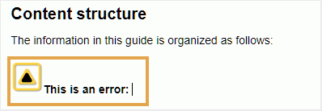{width="400" align="left"}

**이미지 맵 삽입/편집** - 

선택한 이미지에 이미지 맵을 삽입합니다. 주제나 웹 페이지에 연결하는 클릭 가능한 영역이 있는 이미지를 이미지 맵이라고 합니다.

현재 항목에서 이미지를 선택하고 이미지 맵 삽입/편집 아이콘을 클릭하여 이미지 맵 삽입 대화 상자를 엽니다.

{width="650" align="left"}

원하는 모양 사각형 선택 , 원 , 또는 다각형  링크로 사용할 이미지를 기준으로 영역을 정의하는 데 사용됩니다. 영역을 정의한 후 내부 또는 외부 컨텐츠에 대한 링크를 지정해야 하는 참조 대화 상자가 나타납니다.

{width="650" align="left"}

영역이 겹치는 경우 도구 모음에서 각 아이콘을 클릭하여 모양을 앞으로 가져오거나 뒤로 보낼 수 있습니다. 영역을 선택하고 삭제 아이콘을 클릭하여 제거할 수도 있습니다. 영역을 두 번 클릭하면 대상 링크를 변경할 수 있는 참조 대화 상자가 열립니다. 이미지에서 필요한 영역을 표시한 후 완료를 클릭하여 변경 사항을 저장합니다.

**잠금/잠금 해제** - / 

현재 파일을 잠그거나 잠금 해제합니다. 파일을 \(또는 체크 아웃하는\)로 잠그면 파일에 대한 사용자 전용 쓰기 액세스가 제공됩니다. 파일이 잠금 해제됨 \(또는 체크 인됨\)이면 변경 내용이 파일의 현재 버전에 저장됩니다.

맵 보기에 있고 상위 맵을 확장하는 경우, 한 번의 클릭으로 맵의 모든 파일을 잠글 수 있습니다. 상위 맵 파일을 확장하고 상위 파일을 선택하면 맵 내의 모든 파일이 선택됩니다. 그런 다음 잠금 아이콘을 클릭하여 맵 내의 모든 파일에 대한 잠금을 가져올 수 있습니다.

**태그 보기 전환** - 

태그는 요소의 경계를 나타내는 시각적 큐입니다. 요소 경계는 요소의 시작과 끝을 표시합니다. 그런 다음 이러한 경계를 시각적 큐로 사용하여 삽입 지점을 배치하거나 경계 내에서 텍스트를 선택할 수 있습니다. 문서에서 요소의 앞이나 뒤에 다른 요소를 삽입하려는 경우 요소의 앞이나 뒤로 삽입 점을 배치할 수 있습니다.

다음 스크린샷에서는 태그 보기가 있는 문서를 보여줍니다.

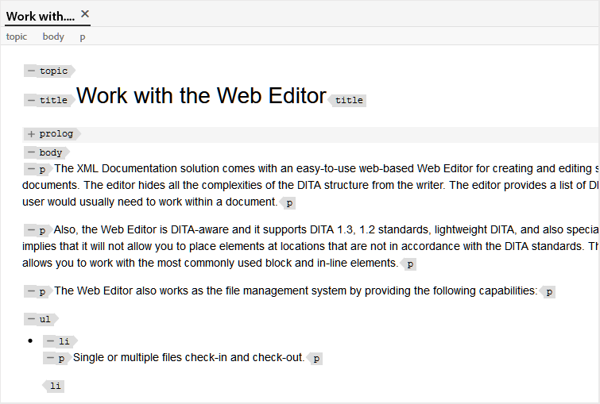{width="650" align="left"}

태그 보기가 설정된 문서에서 다음 작업을 수행할 수 있습니다.

- **요소 선택**: 요소의 열기 또는 닫기 태그를 클릭하여 해당 콘텐츠를 선택합니다.

- **태그 확장 또는 축소**: + 또는 - 태그를 클릭하여 확장하거나 축소합니다.

- **컨텍스트 메뉴 사용**: 컨텍스트 메뉴에서는 선택한 요소를 잘라내거나 복사하거나 붙여넣는 옵션을 제공합니다. 선택한 요소 앞이나 뒤에 요소를 삽입할 수도 있습니다. 다른 옵션을 사용하면 ID를 생성하거나 선택한 요소에 대한 속성 패널을 열 수 있습니다.

- **요소를 드래그하여 놓습니다**: 요소의 태그를 선택하고 문서에 쉽게 드래그하여 놓습니다. 드롭 위치가 요소가 허용된 유효한 위치인 경우 요소는 드롭된 위치에 배치됩니다.


>[!NOTE]
>
> 사용자가 웹 편집기에서 태그 보기를 활성화하면 세션 중에도 활성화되어 있습니다. 즉, 나중에 액세스할 수 있도록 태그 보기를 다시 활성화할 필요가 없습니다. 새 사용자 세션에 대한 태그 보기의 기본값은 ui\_config.json 파일의 tagsView 속성에 의해 결정됩니다. 자세한 내용은 *태그 보기에 대한 기본값 구성* 섹션을 참조하십시오.

**변경 내용 추적 활성화/비활성화** 

변경 내용 추적 모드를 활성화하여 문서에서 수행한 모든 업데이트를 추적할 수 있습니다. 추적 변경을 활성화하면 문서에 모든 삽입 및 삭제 내용이 캡처됩니다. 삭제된 모든 컨텐츠는 취소선을 사용하여 강조 표시되고 모든 삽입은 녹색 색상 텍스트로 강조 표시됩니다. 또한 주제 페이지의 가장자리에 변경 막대가 표시됩니다. 삭제된 컨텐츠에 대한 빨간색 막대가 표시되고 추가된 컨텐츠에 대한 녹색 막대가 표시됩니다. 동일한 줄에 추가 및 삭제가 있을 경우 녹색 및 빨간색 막대가 모두 표시됩니다.

다음 스크린샷에서는 삭제 및 삽입된 컨텐츠와 변경 막대가 강조 표시됩니다.

{width="650" align="left"}

문서의 변경 사항을 추적하는 일반적인 사용 사례는 피어 검토를 수행하는 데 사용될 수 있습니다. 변경 내용 추적을 활성화하고 검토할 문서를 공유할 수 있습니다. 검토자는 변경 내용 추적 켜기를 사용하여 변경 작업을 수행합니다. 문서를 받을 때 변경 사항을 수락하거나 거부할 수 있는 편리한 방법과 함께 제안된 업데이트를 보는 메커니즘이 있어야 합니다.

AEM 안내서에서는 문서에서 수행한 업데이트에 대한 정보가 포함된 변경 내용 추적 기능을 제공합니다. 추적된 변경 사항 기능에서는 어떤 업데이트가 이루어졌는지, 누가 업데이트를 만들었는지, 언제 업데이트하는지에 대한 정보를 제공합니다. 추적된 변경 내용 기능을 사용하면 문서에서 제안된 업데이트를 쉽게 수락하거나 거부할 수도 있습니다.

이 기능에 액세스하려면 오른쪽 패널에서 변경 내용 추적 아이콘을 클릭합니다.

{width="300" align="left"}

변경을 클릭하면 문서에서 변경된 내용이 선택됩니다. 변경 승인(Accept Change) 아이콘을 선택하여 변경 사항을 수락하거나 변경 거부(Reject Change)를 선택하여 변경할 수 있습니다.

한 번의 클릭으로 모든 변경 사항을 수락하거나 거부하려면 **모두 수락** 또는 **모두 거부**.

>[!NOTE]
>
> 미리 보기 모드에서는 변경된 컨텐츠의 마크업을 사용하거나 사용하지 않고 문서를 볼 수 있습니다. 자세한 내용은 [미리 보기](web-editor-views.md#preview-mode-id19AAGL00163) 모드.

**병합** - 

다중 작성 환경에서 작업하는 경우 주제 또는 맵에서 다른 작성자가 변경한 사항을 추적하기가 어렵습니다. 병합 기능을 사용하면 변경 내용을 볼 수 있을 뿐만 아니라 최신 버전의 문서에서 유지되는 변경 사항을 보다 세밀하게 제어할 수 있습니다.

**항목 파일 병합**

항목의 변경 내용을 병합하려면 다음 단계를 수행합니다.

1. 웹 편집기에서 항목을 엽니다.

1. 클릭 **병합**.

   병합 대화 상자가 나타납니다.

   {width="550" align="left"}

1. *\(선택 사항\)* 저장소의 다른 위치에서 새 파일을 찾아 선택할 수도 있습니다.

1. 파일의 현재 버전을 비교할 파일 버전을 선택합니다.

1. 옵션에서 다음을 선택합니다.

   - **선택한 버전에서 변경 내용 추적**: 이 옵션은 추적 변경 사항 양식의 모든 콘텐츠 업데이트를 표시합니다. 그런 다음 문서의 변경 내용을 한 번에 하나씩 또는 한 번에 모두 수락하거나 거부하도록 선택할 수 있습니다.

   - **선택한 버전으로 되돌리기**: 이 옵션은 문서의 현재 버전을 선택한 버전으로 되돌립니다. 이 옵션은 수락하거나 거부할 콘텐츠에 대한 제어 권한을 제공하지 않습니다.

1. 클릭 **완료**.

1. 을(를) 선택한 경우 **선택한 버전에서 변경된 추적** 옵션을 선택하면 선택한 버전의 모든 변경 사항이 오른쪽 패널의 추적된 변경 내용 기능에 표시됩니다.

   추적된 변경 내용 패널에서 모든 주석을 수락 또는 거부하거나 개별 주석을 수락하거나 거부할 수 있습니다.


**맵 파일 병합**

맵 파일에서 변경 내용을 병합하려면 다음 단계를 수행합니다.

1. 웹 편집기에서 맵을 엽니다.

1. 클릭 **병합**.

   병합 대화 상자가 나타납니다.

   {width="550" align="left"}

1. *\(선택 사항\)* 저장소의 다른 위치에서 새 파일을 찾아 선택할 수도 있습니다.

1. 파일의 현재 버전을 비교할 파일 버전을 선택합니다.

1. 옵션에서 다음을 선택합니다.

   - **선택한 버전에서 변경 내용 추적**: 이 옵션은 추적 변경 사항 양식의 모든 콘텐츠 업데이트를 표시합니다. 그런 다음 문서의 변경 내용을 한 번에 하나씩 또는 한 번에 모두 수락하거나 거부하도록 선택할 수 있습니다.

   - **선택한 버전으로 되돌리기**: 이 옵션은 문서의 현재 버전을 선택한 버전으로 되돌립니다. 이 옵션은 수락하거나 거부할 콘텐츠에 대한 제어 권한을 제공하지 않습니다.

1. 클릭 **완료**.

   1. 을(를) 선택한 경우 **선택한 버전에서 변경된 추적** 옵션을 선택하면 선택한 버전의 모든 변경 사항이 오른쪽\[추적된 변경 내용] 패널에 표시됩니다.

      추적된 변경 내용 패널의 모든 변경 내용을 적용 또는 거부하거나 맵 파일의 개별 변경 사항을 수락 또는 거부하도록 선택할 수 있습니다.


**버전 내역** - 

AEM 안내서에서는 주제 파일에 대해 만들어진 버전을 보는 다양한 방법과 특정 버전으로 되돌리는 방법을 제공합니다. 그러나 이러한 기능 중 대부분은 웹 편집기 외부에서 사용할 수 있습니다.

웹 편집기의 버전 기록 기능을 사용하면 활성 주제의 사용 가능한 버전과 레이블을 확인할 수 있을 뿐만 아니라 편집기 자체의 모든 버전으로 되돌릴 수 있습니다.

버전 내역에 액세스하고 특정 버전의 항목으로 되돌리려면 다음 단계를 수행하십시오.

1. 웹 편집기에서 항목을 엽니다.

1. 클릭 **버전 기록**.

   버전 기록 대화 상자가 나타납니다.

   {width="550" align="left"}

1. 에서 되돌릴 항목의 버전을 선택합니다 **버전 선택** 드롭다운 목록.

   >[!NOTE]
   >
   > 버전에 적용된 레이블이 있으면 버전 번호와 함께 \(대괄호\)도 표시됩니다.

   드롭다운 목록에서 버전을 선택하면 선택한 버전으로 되돌리기 옵션을 사용할 수 있습니다. 미리 보기 창에는 현재 버전과 선택한 항목 버전 간의 차이가 표시됩니다.

   {width="550" align="left"}

1. 클릭 **선택한 버전으로 되돌리기** 작업 복사본을 선택한 버전의 항목으로 되돌립니다.

   버전 되돌리기 대화 상자가 나타납니다.

   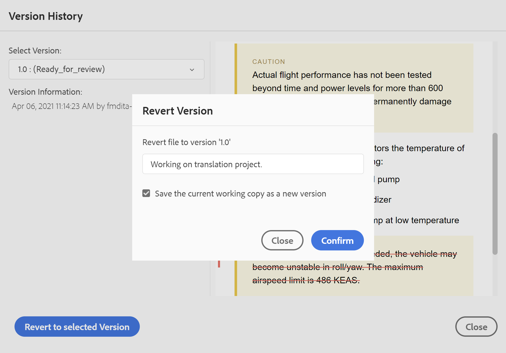{width="550" align="left"}

1. \(*선택 사항입니다*\) 이전 버전으로 되돌릴 이유를 제공합니다. 항목의 현재 활성 작업 복사본에 대한 새 버전을 만들 수도 있습니다.

1. 클릭 **확인.**

   파일의 작업 복사본이 선택한 버전으로 되돌립니다. 현재 활성 상태인 작업 사본의 새 버전을 작성하도록 선택한 경우 모든 작업 변경 사항으로 파일의 새 버전도 생성됩니다.


이전 버전으로 되돌릴 때 현재 작업 중인 버전이 최신 버전이 아님을 나타내는 시각적 큐가 표시됩니다.

{width="800" align="left"}

**버전 레이블 관리** -  

레이블은 DLC \(문서 개발 수명 주기\)에 특정 주제가 있는 단계를 식별하는 데 도움이 됩니다. 예를 들어 주제에 대해 작업하는 경우 레이블을 &quot;Approved&quot;로 설정할 수 있습니다. 주제가 게시되어 고객이 사용할 수 있게 되면 해당 항목에 &quot;릴리스됨&quot; 레이블을 지정할 수 있습니다.

AEM 가이드를 사용하면 자유 형식 텍스트 형식으로 레이블을 지정하거나 사전 정의된 레이블 세트를 사용할 수 있습니다. 사용자 지정 레이블을 사용하면 시스템의 모든 작성자가 원하는 대로 레이블을 지정할 수 있습니다. 이는 유연성을 제공합니다. 그러나 시스템에서 일관되지 않은 레이블을 도입합니다. 이 문제를 해결하기 위해 관리자는 사전 정의된 레이블 세트를 구성할 수 있습니다. 사전 정의된 레이블 구성에 대한 자세한 내용은 *XML Web Editor 구성 및 사용자 정의* 를 클릭하여 Adobe Experience Manager 안내서 설치 및 구성 as a Cloud Service으로 섹션을 참조하십시오.

이러한 레이블은 작성자가 레이블을 지정해야 하는 위치에 드롭다운 목록 형태로 표시됩니다. 이렇게 하면 미리 정의된 일관된 레이블만 시스템에서 사용됩니다.

주제에 레이블을 적용할 수 있는 다양한 방법이 있습니다. [버전 기록](web-editor-use-label.md#) 자산 UI의 패널, [기준선](/help/tutorials/user-guide/generate-output-use-baseline-for-publishing.md#id184KD0T305Z) UI 및 웹 편집기. 작성자는 웹 편집기의 버전 레이블 기능을 사용하여 항목에 레이블을 빠르고 쉽게 지정할 수 있습니다.

웹 편집기에서 주제에 레이블을 추가하려면 다음 단계를 수행하십시오.

1. 웹 편집기에서 항목을 엽니다.

1. 클릭 **버전 레이블**.

   버전 레이블 관리 대화 상자가 나타납니다.

   {width="650" align="left"}

   버전 레이블 관리 대화 상자는 두 부분으로 분할됩니다. 왼쪽 패널에는 레이블 드롭다운 목록 \(또는 레이블을 입력할 텍스트 상자\) 및 주제 미리 보기가 있는 오른쪽 패널과 함께 주제에 사용할 수 있는 버전 목록이 있습니다.

1. 레이블을 적용할 버전을 선택합니다.

   버전 목록에서 다른 버전의 주제를 선택하면 미리 보기 패널에 현재 버전과 선택한 버전의 주제 간 변경 사항이 표시됩니다

   >[!NOTE]
   >
   > 버전에 이미 레이블이 적용된 경우 드롭다운 목록의 버전 번호 옆에 및 버전 선택 목록 아래에 표시됩니다. 기존 레이블을 제거하려면 \(**x**\) 아이콘을 클릭합니다.

1. 관리자가 레이블 목록을 정의한 경우 적용할 레이블을 선택할 수 있는 레이블의 드롭다운 목록이 표시됩니다. 드롭다운 목록에서 여러 레이블을 선택할 수 있습니다.

   그렇지 않으면 텍스트 상자에 항목을 추가할 레이블을 입력할 수 있습니다.

   >[!NOTE]
   >
   > 항목의 여러 버전에 동일한 레이블을 적용할 수 없습니다. 기존 레이블을 연결하려고 하면 기존 버전에서 제거하고 선택한 버전의 주제에 적용하는 옵션이 제공됩니다.

1. 클릭 **레이블 추가**.

1. 레이블 적용 확인 메시지에서 **레이블 이동** 기존 버전에서 선택한 버전으로 레이블을 이동하는 옵션. 이 옵션을 선택하지 않고 항목의 다른 버전에 지정된 레이블이 있으면 선택한 항목의 버전으로 이동되지 않습니다. 이러한 레이블은 레이블 응용 프로그램 프로세스에서 무시됩니다.


**리뷰 작업 만들기** -  

현재 항목의 검토 작업을 만들거나 웹 편집기에서 직접 파일을 매핑할 수 있습니다. 검토 작업을 생성할 파일을 열고 검토 작업 생성을 눌러 검토 생성 프로세스를 시작합니다.

>[!NOTE]
>
> 오른쪽 검토 패널 \(오른쪽\)에서 검토 작업을 만들 수도 있습니다.

에 제공된 지침을 따르십시오. [항목 또는 맵 검토](review.md#) 자세한 내용

## 왼쪽 패널 {#id2051EA0M0HS}

왼쪽 패널은 지속 패널입니다. 사이드바 확장 아이콘 \( )을 클릭하여 확장하거나 축소할 수 있습니다\) 확장된 보기에서는 축소된 보기에서 도구 설명에 나타나는 아이콘의 이름이 표시됩니다.

>[!NOTE]
>
> 왼쪽 패널의 크기를 조정할 수 있습니다. 패널 크기를 조정하려면 패널 경계에 커서를 놓으면 커서가 양방향 화살표로 바뀌고 클릭한 후 드래그하여 패널 너비의 크기를 조정합니다.

왼쪽 패널에서는 다음 기능에 액세스할 수 있습니다.

**즐겨찾기** -  

파일 또는 폴더 집합에서 작업하는 경우 즐겨찾는 목록에 추가하여 빠르게 액세스할 수 있습니다. 즐겨찾기 목록에는 추가한 문서 목록과 다른 사용자가 자주 사용하는 문서 목록이 표시됩니다.

즐겨찾기 목록 또는 컬렉션을 만들려면 즐겨찾기 패널 옆에 있는 + 아이콘을 클릭하여 새 컬렉션 미디어 로그를 표시합니다.

{width="300" align="left"}

만들려는 즐겨찾는 컬렉션의 제목과 설명을 입력합니다. 선택하는 경우 **공용**&#x200B;를 누르고 나면 다른 사용자에게도 이 즐겨찾기가 표시됩니다.

즐겨찾는 컬렉션에 파일을 추가하려면 다음 방법 중 하나를 사용하십시오.

- 저장소 보기에서 필요한 파일 또는 폴더로 이동하여 *옵션* 아이콘을 클릭하여 컨텍스트 메뉴를 열고 **즐겨찾기에 추가**. 즐겨찾기에 추가 대화 상자에서 파일/폴더를 기존 즐겨찾기에 추가하거나 새 즐겨찾기에 추가하도록 선택할 수 있습니다.

   {width="300" align="left"}

- 편집기에서 파일의 탭을 마우스 오른쪽 단추로 클릭하여 컨텍스트 메뉴를 엽니다. 선택 **\> 즐겨찾기에 추가** 즐겨찾기 목록에 파일을 추가하려면

   {width="400" align="left"}


>[!NOTE]
>
> 즐겨찾기 목록에서 항목을 제거하려면 즐겨찾기 목록의 파일 또는 폴더 옆에 있는 옵션 아이콘을 클릭하고 **즐겨찾기에서 제거**.

**저장소 보기** - 

저장소 보기 아이콘을 클릭하면 DAM에서 사용할 수 있는 파일 및 폴더 목록이 표시됩니다.

한 번에 75개의 파일이 로드됩니다. 클릭할 때마다 **추가 로드**...75개의 파일이 로드되고 모든 파일이 나열되면 버튼이 표시되지 않습니다. 이 배치 로드는 효율적이며 폴더에 있는 모든 파일을 로드하는 것과 비교하여 파일에 더 빨리 액세스할 수 있습니다.

DAM 내에서 필요한 파일로 손쉽게 이동하여 웹 편집기에서 열 수 있습니다. 파일을 편집하는 데 필요한 액세스 권한이 있는 경우 그렇게 할 수 있습니다.

웹 편집기에서 오디오 또는 비디오 파일을 클릭하고 재생할 수도 있습니다. 볼륨 또는 비디오 보기를 변경할 수 있습니다. 바로 가기 메뉴에는 다운로드, 재생 속도 변경 또는 화면 속 화면 보기 옵션이 있습니다.


맵 파일을 두 번 클릭하면 **맵 보기**. 자세한 내용은 **맵 보기** 의 기능 설명 [왼쪽 패널](web-editor-features.md#id2051EA0M0HS) 섹션을 참조하십시오. 주제 파일을 두 번 클릭하면 [콘텐츠 편집 영역](#id2051EB000UI). 웹 편집기에서 직접 파일을 탐색하고 열 수 있으므로 시간이 절약되고 생산성이 향상됩니다.

**검색 필터링**

웹 편집기에서는 텍스트 검색을 위한 향상된 필터를 제공합니다. 필터 검색 \(\)아이콘을 클릭하여 필터 패널을 엽니다. AEM 저장소의 선택한 경로에 있는 파일에서 텍스트를 검색할 수 있습니다. 예를 들어 &#39;일반 목적&#39;은 아래 스크린샷에서 검색됩니다.

{width="400" align="left"}

또한 파일을 필터링하고 AEM 저장소에서 검색 범위를 좁히는 다음 옵션이 있습니다.

- **DITA 파일**: 모든 것을 찾을 수 있습니다 **DITA 주제** 및 **DITA 맵** 선택한 경로에 표시됩니다.
- **비 DITA 파일**: 을 검색할 수 있습니다 **이미지 파일**, **멀티미디어**, 및 **문서** 을 입력합니다.
- **DITA 요소**: 지정된 DITA 요소의 특성에서 특정 값을 검색할 수도 있습니다.
- **체크 아웃한 사람**: 지정한 사용자가 체크 아웃한 파일을 찾을 수 있습니다.
- **마지막 수정 날짜**: 선택한 날짜 이후에 선택한 날짜 이전에 마지막으로 수정된 파일을 찾을 수 있습니다. 또한 지난 2시간, 지난 주, 지난 달 또는 지난 해에 마지막으로 수정된 파일을 찾을 수 있습니다.
- **태그**: 특정 태그가 적용된 파일을 찾을 수 있습니다. 태그를 입력하거나 드롭다운 목록에서 선택할 수 있습니다.

**참고:** 시스템 관리자가 텍스트 필터를 구성하고 다른 필터를 표시하거나 숨길 수도 있습니다. 자세한 내용은 *텍스트 필터 구성* 섹션을 참조하십시오.

검색된 텍스트가 포함된 필터링된 파일 목록이 표시됩니다. 예를 들어 위의 스크린샷에서는 &#39;일반 용도&#39; 텍스트가 포함된 파일이 나열됩니다. 필터링된 목록에서 여러 파일을 선택하여 편집을 위해 열린 맵에 끌어서 놓을 수 있습니다.

**옵션 메뉴**

왼쪽 패널에서 파일을 여는 것 외에도

저장소 보기에서 사용할 수 있는 옵션 메뉴. 폴더, 주제 파일 또는 미디어 파일을 선택하는지에 따라 다른 옵션이 표시됩니다.

**폴더 옵션**

다음 작업에 사용할 수 있는 옵션 메뉴를 사용하여 다음 작업을 수행할 수 있습니다 *폴더* 저장소 보기에서 다음을 수행합니다.

{width="550" align="left"}


- **만들기**: 새 DITA 주제, DITA 맵 또는 폴더를 만듭니다. 자세한 내용은  **저장소 보기에서 주제 만들기** 의 절차 [왼쪽 패널](web-editor-features.md#id2051EA0M0HS) 섹션을 참조하십시오.


- **자산 업로드**: 로컬 시스템의 파일을 AEM 저장소의 선택한 폴더로 업로드합니다. 로컬 시스템의 파일을 현재 작업 항목으로 드래그 앤 드롭할 수도 있습니다. 로컬 시스템의 이미지를 주제에 삽입하려는 경우 매우 유용합니다.

   {width="550" align="left"}

   파일을 업로드할 폴더를 선택할 수 있으며 이미지 미리 보기도 표시됩니다. 파일 이름을 바꾸려는 경우 파일 이름 텍스트 상자에서 이 작업을 수행할 수 있습니다. 업로드 를 클릭하여 파일 업로드 프로세스를 완료합니다. 이미지 파일을 주제에 끌어다 놓은 경우 이미지 파일이 문서에 추가되고 업로드됩니다.

   관리자가 의 UUID 옵션을 활성화한 경우 *XMLEditorConfig*&#x200B;를 반환하려면에서 업로드된 이미지의 UUID가 표시됩니다 **소스** 속성을 사용합니다.

   {width="800" align="left"}

- **폴더에서 파일 찾기**: 검색어를 입력할 수 있는 저장소 검색으로 포커스를 이동합니다. 저장소의 선택한 폴더에서 검색이 수행됩니다. 필터를 적용하여 DITA 파일, 이미지 파일 또는 둘 다를 반환할 수도 있습니다.

   {width="400" align="left"}

   파일의 UUID를 사용하여 검색할 수도 있습니다. 이 경우 검색 결과에 DITA/XML 파일의 제목이 표시되고 파일의 경우 이미지 파일이 표시되면 파일의 UUID가 표시됩니다. 다음 검색 예에서 이미지 파일의 UUID를 검색하고 검색 결과에 원본 이미지 파일의 UUID와 해당 이미지를 참조하는 파일의 주제 제목이 표시됩니다.

   {width="300" align="left"}

- **모두 축소**: 저장소에서 열려 있는 모든 폴더를 축소하고 루트 수준 폴더만 표시합니다.

   >[!NOTE]
   >
   > 를 사용하십시오 **\>** 폴더 옆에 있는 아이콘을 클릭하여 확장합니다.

- **즐겨찾기에 추가**: 선택한 폴더를 즐겨찾기에 추가합니다. 기존 또는 새 즐겨찾기 컬렉션에 추가하도록 선택할 수 있습니다.

- **새로 고침**: 저장소에서 파일 및 폴더의 새 목록을 가져옵니다.
- **자산 UI에서 보기**: 자산 UI에 폴더 컨텐츠를 표시합니다.

**파일 옵션**

미디어 파일 또는 DITA 파일 선택 여부에 따라 옵션 메뉴에 다른 옵션이 표시됩니다. 미디어 및 DITA 파일 모두에 사용할 수 있는 몇 가지 일반적인 옵션은 다음과 같습니다.

- 복제
- 체크아웃/체크인
- 미리보기
- 삭제
- 복사
- 모두 축소
- 즐겨찾기에 추가
- 속성
- 자산 UI에서 보기

{width="550" align="left"}

옵션 메뉴의 다양한 옵션이 아래에 설명되어 있습니다.

- **편집**: 편집할 파일을 엽니다. .ditamap/.bookmap 파일의 경우 [고급 맵 편집기](map-editor-advanced-map-editor.md#) 참조하십시오.

- **복제**: 이 옵션을 사용하여 선택한 파일의 복제 또는 복사본을 만듭니다. 또한 자산 복제 프롬프트에서 중복 파일의 이름을 바꾸는 옵션이 있습니다. 기본적으로 파일은 \(파일 이름\_1.extension\) 접미사를 사용하여 만들어집니다. 파일의 제목은 소스 파일과 동일하게 유지되며 새 파일은 버전 1.0으로 시작합니다. 베이스라인이 중복 파일에 복사되지 않는 동안 모든 참조, 태그 및 메타데이터가 복사됩니다.
- **체크 아웃**: 편집을 위해 선택한 파일을 잠급니다. 잠긴 파일의 경우 이 옵션이 **체크인**.

   >[!NOTE]
   >
   > 파일이 잠겼거나 사용자에 의해 체크 아웃된 경우, 마우스 포인터를 잠금 아이콘 위로 가져가면 파일을 잠근 사용자 \(name\)가 표시됩니다.

- **미리 보기**: 파일 \(.dita/.xml\)을 열지 않고 빠른 미리 보기를 가져옵니다.

   {width="800" align="left"}

- **삭제**: 선택한 파일을 삭제하려면 이 옵션을 사용합니다. 파일을 삭제하기 전에 확인 메시지가 표시됩니다.

   - 파일을 삭제하기 전에 확인 메시지가 표시됩니다.
   - 파일이 다른 파일에서 참조되지 않으면 삭제되고 성공 메시지가 표시됩니다.
   - 파일을 체크 아웃한 경우에는 삭제할 수 없으며 오류 메시지가 표시됩니다.

      >[!NOTE]
      >
      > 관리자가 체크 아웃된 파일을 삭제하지 못한 경우에는 오류 메시지만 표시됩니다. 자세한 내용은 *체크 아웃된 파일의 삭제 방지* 섹션을 참조하십시오.

   - 파일이 즐겨찾기 컬렉션에 추가되는 경우 **강제 삭제** 대화 상자가 표시되면 강제로 삭제할 수 있습니다.
   - 다른 파일에서 파일이 참조되는 경우 **강제 삭제** 확인 메시지가 포함된 대화 상자가 표시되면 파일을 강제로 삭제할 수 있습니다.

      {width="550" align="left"}

      >[!NOTE]
      >
      > 관리자가 파일 삭제 권한을 부여한 경우 **강제 삭제** 이 활성화되어 있습니다. Else, **강제 삭제** 이 비활성화되고 참조된 파일을 삭제할 수 있는 권한이 없다는 메시지가 표시됩니다. 자세한 내용은 *참조된 파일의 삭제 방지* 섹션을 참조하십시오.

   - 참조된 항목을 삭제하고 편집할 참조가 들어 있는 파일을 열면 참조된 파일에 대한 끊어진 링크가 표시됩니다.
   >[!NOTE]
   >
   > 키보드의 Delete 키를 사용하여 선택한 파일을 유사하게 삭제할 수도 있습니다.

- **복사**: 다음 옵션 중에서 선택할 수 있습니다.

   - **UUID 복사**: 선택한 파일의 UUID를 클립보드에 복사합니다.

   - **경로 복사**: 선택한 파일의 전체 경로를 클립보드에 복사합니다.

- **모두 축소**: 저장소의 모든 파일을 축소합니다. 저장소의 최상위 폴더만 표시됩니다.
- **추가 대상**: 다음 옵션 중에서 선택할 수 있습니다.
   - **즐겨찾기**: 선택한 파일을 즐겨찾기에 추가합니다. 기존 또는 새 즐겨찾기 컬렉션에 추가하도록 선택할 수 있습니다.

   - **재사용 가능한 콘텐츠**: 선택한 파일을 왼쪽 패널의 [재사용 가능한 내용] 목록에 추가합니다.

- **속성**: 이 옵션을 사용하여 선택한 파일의 속성 페이지를 엽니다. 이 속성 페이지는 파일을 선택하고 도구 모음의 속성 아이콘을 클릭하여 자산 UI에서 액세스할 수도 있습니다.

- **맵 대시보드 열기**: 선택한 파일이 DITA 맵인 경우 이 옵션을 사용하면 맵 대시보드가 열립니다.

- **자산 UI에서 보기**: 자산 UI에서 .dita/.xml 파일의 미리 보기를 표시하려면 이 옵션을 사용합니다. .ditamap/.bookmap 파일의 경우 맵 내의 모든 주제 파일이 단일 통합 페이지별 보기에 표시됩니다.

- **빠른 생성**: 선택한 파일의 출력을 생성합니다. 출력 사전 설정의 일부인 파일에 대해서만 출력을 생성할 수 있습니다. 자세한 내용은 [웹 편집기에서 문서 기반 게시](web-editor-article-publishing.md#id218CK0U019I).


**저장소 보기에서 주제 만들기**

저장소 패널 옆에 있는 + 아이콘 또는 저장소 보기에 있는 폴더의 컨텍스트 메뉴에서 새 주제, 맵 또는 폴더를 만들도록 선택할 수 있습니다.

***주제 만들기***

선택 시 *새 항목 만들기* 메뉴에서 다음 대화 상자가 표시됩니다.

{width="300" align="left"}

에서 **새 항목 만들기** 대화 상자에서 다음 세부 정보를 제공합니다.

- 주제가 기반으로 할 템플릿입니다. 예를 들어, 기본 설정의 경우 빈 템플릿, 개념, DITAVAL, 참조, 작업, 주제 및 문제 해결 템플릿 중에서 선택할 수 있습니다.

   폴더에 폴더 프로필이 구성되어 있으면 폴더 프로필에 구성된 주제 템플릿만 표시됩니다.

- 주제 파일을 저장할 경로입니다. 기본적으로 저장소에서 현재 선택한 폴더의 경로가 경로 필드에 표시됩니다.
- 항목의 제목입니다.

- *\(선택 사항\)* 항목의 파일 이름입니다. 파일 이름은 제목 항목을 기반으로 자동으로 제안됩니다.

   관리자가 UUID 설정을 기반으로 자동 파일 이름을 활성화한 경우 다음 스크린샷에 표시된 이름 필드가 표시되지 않습니다.

   {width="300" align="left"}


를 클릭하면 **만들기**&#x200B;지정된 경로에 주제가 만들어집니다. 또한 웹 편집기에서 편집할 주제를 엽니다.

***DITA 맵 만들기***

선택 시 *새 DITA 맵 만들기*, 다음 대화 상자가 표시됩니다.

{width="300" align="left"}

에서 **새 맵 만들기** 대화 상자에서 다음 세부 정보를 제공합니다.

- 맵이 기반으로 할 템플릿입니다. 예를 들어, 기본 설정의 경우 북맵 또는 DITA 맵 템플릿에서 선택할 수 있습니다.

- 맵 파일을 저장할 경로입니다. 기본적으로 저장소에서 현재 선택한 폴더의 경로가 경로 필드에 표시됩니다.
- A **제목** 참조하십시오.

- *\(선택 사항\)* 맵의 파일 이름입니다. 파일 이름은 맵 제목을 기반으로 자동으로 제안됩니다.

   관리자가 UUID 설정을 기반으로 자동 파일 이름을 활성화한 경우에는 이름 필드가 표시되지 않습니다.


를 클릭하면 **만들기**&#x200B;를 입력하면 경로 필드에 지정된 폴더에 맵이 만들어지고 추가됩니다. 또한 맵이 맵 보기에서 열립니다. 맵 파일을 맵 편집기에서 열고 주제를 추가할 수 있습니다. 맵 파일에 항목을 추가하는 방법에 대한 자세한 내용은 [맵 만들기](map-editor-create-map.md#).

***폴더를 만듭니다***

선택 시 *새 폴더 만들기*, 다음을 수행합니다. **새 폴더 만들기** 대화 상자:

{width="300" align="left"}

을(를) 입력합니다. **제목** 폴더 이름으로 자동 변환됩니다. 경로는 맵 파일을 저장할 위치입니다. 기본적으로 저장소에서 현재 선택한 폴더의 경로가 경로 필드에 표시됩니다. 를 클릭하면 **만들기**&#x200B;를 입력하면 폴더가 만들어져서 폴더 만들기 옵션이 실행된 폴더 내에 추가됩니다.

**맵 보기** -  

맵 보기 아이콘을 클릭하면 맵 파일 내에 주제 목록이 표시됩니다. 맵 파일을 열지 않은 경우 맵 보기가 공백으로 표시됩니다. 맵 파일을 두 번 클릭하면 이 보기에서 맵 파일이 열립니다. 맵 내에서 파일을 두 번 클릭하여 웹 편집기에서 열 수 있습니다. 맵 보기에서 맵을 열면 현재 맵의 제목이 기본 도구 모음의 가운데에 표시됩니다. 제목이 너무 긴 경우 생략 부호가 표시되고 제목 위로 마우스를 가져가면 도구 설명에 전체 제목이 표시됩니다. 맵 파일에 대한 편집 권한이 있는 경우 파일도 편집할 수 있습니다. DITA 맵을 통해 주제 열기 및 편집에 대한 자세한 내용은 [DITA 맵을 통해 주제 편집](map-editor-advanced-map-editor.md#id17ACJ0F0FHS).

맵 파일의 옵션 메뉴를 사용하여 다음 작업을 수행할 수 있습니다.

{width="550" align="left"}

- **편집**: 고급 맵 편집기에서 편집할 맵 파일을 엽니다.

- **모두 선택**: 맵에서 모든 파일을 선택합니다.

- **선택 항목 지우기**: 맵에서 선택한 파일을 선택 취소합니다.

- **체크아웃 및 잠금**: 체크 아웃하고 맵에서 선택한 파일을 잠급니다.

- **체크아웃 및 잠금 해제 취소**: 맵 파일의 잠금을 해제하고 편집할 수 있도록 합니다. 이전 버전의 변경 사항은 되돌릴 수 없습니다.

- **새 버전으로 저장 및 잠금 해제**: 최신 버전을 만들고 맵에서 선택한 파일에 대한 잠금을 해제합니다.

- **미리 보기**: 맵 파일의 미리 보기를 엽니다. 이 보기에서는 맵 내의 모든 주제 파일이 단일 통합 페이지별 보기에 표시됩니다.

- **복사**: 다음 옵션 중에서 선택할 수 있습니다.
   - **UUID 복사**: 맵 파일의 UUID를 클립보드에 복사합니다.
   - **경로 복사**: 맵 파일의 전체 경로를 클립보드에 복사합니다.

- **저장소에서 찾기**: 저장소에서 맵 파일의 위치를 \(또는 DAM\)에 표시합니다.

- **추가 대상**: 다음 옵션 중에서 선택할 수 있습니다.
   - **즐겨찾기**: 맵 파일을 즐겨찾기에 추가합니다. 기존 또는 새 즐겨찾기 컬렉션에 추가하도록 선택할 수 있습니다.

   - **재사용 가능한 콘텐츠**: 맵 파일을 왼쪽 패널의 재사용 가능한 콘텐츠 목록에 추가합니다.

- **속성**: 맵 파일의 속성 페이지를 열려면 이 옵션을 사용합니다. 이 속성 페이지는 파일을 선택하고 도구 모음의 속성 아이콘을 클릭하여 자산 UI에서 액세스할 수도 있습니다.

- **맵 대시보드 열기**: 맵 대시보드를 엽니다.

- **자산 UI에서 보기**: 자산 UI에 맵 파일의 미리 보기를 표시하려면 이 아이콘을 사용합니다. 이 보기에서는 맵 내의 모든 주제 파일이 단일 통합 페이지별 보기에 표시됩니다.

- **빠른 생성**: 선택한 맵 파일의 출력을 생성합니다. 출력 사전 설정의 일부인 파일에 대해서만 출력을 생성할 수 있습니다. 자세한 내용은 [웹 편집기에서 문서 기반 게시](web-editor-article-publishing.md#id218CK0U019I).
- **닫기**: 맵 파일을 닫습니다.

다음 스크린샷에서는 DITA 맵 보기에서 파일에 대한 옵션 메뉴를 보여 줍니다.

{width="550" align="left"}

옵션 메뉴를 사용하여 다음 작업을 수행할 수 있습니다.

- **편집**: 편집할 파일을 엽니다. .ditamap/.bookmap 파일의 경우 [고급 맵 편집기](map-editor-advanced-map-editor.md#) 참조하십시오.

- **체크 아웃**: 선택한 파일을 체크 아웃합니다. 체크 아웃된 파일의 경우 이 옵션은 **체크인**.

   >[!NOTE]
   >
   > 파일이 잠겼거나 사용자에 의해 체크 아웃된 경우, 마우스 포인터를 잠금 아이콘 위로 가져가면 파일을 잠근 사용자 \(name\)가 표시됩니다.

- **미리 보기**: 파일 \(.dita/.xml\)을 열지 않고 빠른 미리 보기를 가져옵니다.
- **복사**: 다음 옵션 중에서 선택할 수 있습니다.
   - **UUID 복사**: 선택한 파일의 UUID를 클립보드에 복사합니다.
   - **경로 복사**: 선택한 파일의 전체 경로를 클립보드에 복사합니다.

- **저장소에서 찾기**: 저장소에서 선택한 파일의 위치를 \(또는 DAM\)에 표시합니다.
- **모두 확장**: 맵 파일의 모든 항목을 확장합니다.

- **모두 축소**: 현재 맵 파일의 일부인 모든 항목을 축소합니다.

- **추가 대상**: 다음 옵션 중에서 선택할 수 있습니다.
   - **즐겨찾기**: 선택한 파일을 즐겨찾기에 추가합니다. 기존 또는 새 즐겨찾기 컬렉션에 추가하도록 선택할 수 있습니다.

   - **재사용 가능한 콘텐츠**: 선택한 파일을 왼쪽 패널의 [재사용 가능한 내용] 목록에 추가합니다.

- **속성**: 이 옵션을 사용하여 선택한 파일의 속성 페이지를 엽니다. 이 속성 페이지는 파일을 선택하고 도구 모음의 속성 아이콘을 클릭하여 자산 UI에서 액세스할 수도 있습니다.

- **자산 UI에서 보기**: 자산 UI에서 .dita/.xml 파일의 미리 보기를 표시하려면 이 옵션을 사용합니다. .ditamap/.bookmap 파일의 경우 맵 내의 모든 주제 파일이 단일 통합 페이지별 보기에 표시됩니다.

- **빠른 생성**: 선택한 파일의 출력을 생성합니다. 출력 사전 설정의 일부인 파일에 대해서만 출력을 생성할 수 있습니다. 자세한 내용은 [웹 편집기에서 문서 기반 게시](web-editor-article-publishing.md#id218CK0U019I).

>[!NOTE]
>
> DITA 맵에서 선택한 주제의 속성을 열고 편집할 수도 있습니다 **추가 옵션** 맵 보기 하단의 메뉴.

**개요 보기** -  

아웃라인 뷰 아이콘을 클릭하면 문서에 사용된 요소의 계층 뷰가 표시됩니다.

{width="300" align="left"}

개요 보기에서는 다음 기능을 제공합니다.

- 문서에 사용된 모든 요소의 트리 보기입니다.

- 요소에 ID, 속성 및 텍스트가 있는 경우 요소와 함께 이를 볼 수 있습니다.

- 작성자 및 소스 보기 모두에서 개요 보기에 액세스합니다.

- 필터 드롭다운 목록을 사용하여 모든 요소를 표시하거나 손상된 참조만 표시합니다.

- 개요 보기에서 요소를 클릭하면 작성자 또는 소스 보기에서 요소의 컨텐츠가 선택됩니다.개요 보기는 작성자 및 소스 보기와 계속 동기화됩니다. 모든 뷰에서 변경 작업을 수행하면 개요 보기에서 변경 사항을 볼 수 있습니다. 예를 들어, 작성자 보기에서 단락을 추가하거나 요소를 업데이트하는 경우 개요 보기에 표시됩니다.

   {width="650" align="left"}

- 요소를 드래그하여 놓습니다. 요소에 다른 요소를 끌어 놓아 요소를 쉽게 바꿀 수 있습니다. 요소를 다른 요소 위에 끌어다 놓고 요소 주위에 사각형 상자가 표시되면 요소가 대체되는 것입니다. 요소가 드롭된 요소를 대체합니다.

   {width="300" align="left"}

   요소를 끌어다 놓으면 파선 사각형이 요소를 현재 위치에 배치할 수 있음을 나타냅니다. 드래그 앤 드롭이 올바르지 않으면 작업이 허용되지 않음을 나타내는 오류 메시지가 표시됩니다.

   {width="300" align="left"}

- 다음 **옵션** 메뉴의 *개요 보기* 잘라내기, 복사, 삭제, ID 생성, 요소 이전 또는 뒤의 삽입, 요소 이름 변경 또는 바꾸기, 요소 래핑 취소 및 선택한 요소에서 코드 조각 생성과 같은 일반 작업을 수행할 수 있습니다.

>[!NOTE]
>
>ID 생성, 현재 요소 앞이나 뒤에 요소 삽입 및 요소 래핑 해제에 대한 자세한 내용은 [웹 편집기의 기타 기능](web-editor-other-features.md#).

**개요 보기 패널의 보기 옵션**

보기 옵션 드롭다운을 사용하여 요소에 다음 항목이 있을 경우 해당 옵션을 표시하도록 선택할 수 있습니다.

- **ID 표시**: 요소의 ID를 표시합니다.
- **속성 표시**: 속성과 해당 값을 표시합니다.
- **텍스트 표시**: 텍스트를 표시합니다. 텍스트가 20자보다 긴 경우 줄임표가 표시됩니다.

블록 요소에 자체 텍스트가 있는 경우 해당 블록 요소와 함께 표시됩니다. 자체 텍스트가 없으면 첫 번째 하위 요소의 텍스트가 해당 블록 요소와 함께 표시됩니다.

{width="550" align="left"}

관리자가 속성에 대한 프로필을 생성한 경우 해당 속성이 구성된 값과 함께 제공됩니다. 관리자가 구성한 표시 속성을 아래에 할당할 수도 있습니다 **속성 표시** 편집기 설정에서 탭을 클릭합니다. 요소에 대해 정의된 속성이 레이아웃 및 개요 보기에 표시됩니다.


자세한 내용은 *속성 표시* 내 *편집기 설정* 의 기능 설명 [왼쪽 패널](web-editor-features.md#id2051EA0M0HS) 섹션을 참조하십시오.

**검색 기능**
검색 기능을 사용하여 이름, ID, 텍스트 또는 속성 값으로 요소를 검색할 수 있습니다.

검색은 대소문자를 구분하지 않으며 문자열과 정확히 일치합니다. 검색 결과는 문서에서 요소의 위치를 기준으로 정렬됩니다.

[개요 보기] 패널에 표시된 경우 요소에서 문자열을 검색할 수 있습니다. 예를 들어 &quot;Adobe&quot; 문자열이 요소의 텍스트에 있고 ( 선택한 것처럼) 아웃라인 보기 패널에 표시되는 경우 **텍스트 표시** 보기 옵션 드롭다운에서 포함 요소가 필터링됩니다. 텍스트가 [개요 보기] 패널에 표시되지 않을 경우(선택하지 않은 것처럼) **텍스트 표시** 보기 옵션 드롭다운에서 포함 요소가 필터링되지 않습니다. 마찬가지로 ID 또는 속성을 선택한 경우 해당 문자열을 찾습니다.


**재사용 가능한 콘텐츠** -  

DITA의 주요 기능 중 하나는 컨텐츠를 재사용하는 기능입니다. 재사용 가능한 콘텐츠 패널에서는 일반적으로 재사용 가능한 콘텐츠를 삽입한 DITA 파일을 저장할 수 있습니다. 추가된 DITA 파일은 세션 간 재사용 가능한 컨텐트 패널에 유지됩니다. 즉, 나중에 액세스하기 위해 DITA 파일을 다시 추가할 필요가 없습니다.

패널의 재사용 가능한 컨텐츠를 현재 주제로 드래그 앤 드롭하면 쉽고 빠르게 삽입할 수 있습니다. 문서에 내용을 삽입하기 전에 미리 보기를 받을 수도 있습니다.

재사용 가능한 내용 패널에 DITA 파일을 추가하려면 다음 방법 중 하나를 사용합니다.

- 재사용 가능한 콘텐츠 옆에 있는 + 아이콘을 클릭하여 파일 찾아보기 대화 상자를 엽니다. 추가할 파일을 선택하고 **추가** 프로세스를 완료합니다.

   {width="650" align="left"}

- 저장소 보기에서 원하는 파일의 옵션 아이콘을 클릭하고 을 선택합니다 **재사용 가능한 콘텐츠에 추가** 컨텍스트 메뉴에서 을 클릭합니다.

- 편집기에서 파일 탭을 마우스 오른쪽 단추로 클릭하여 컨텍스트 메뉴를 열고 선택합니다 **재사용 가능한 콘텐츠에 추가**.


파일이 추가되면 재사용 가능한 콘텐츠 패널에서 파일의 모든 재사용 가능한 콘텐츠 요소를 볼 수 있습니다. 재사용 가능한 컨텐츠는 해당 ID 및 요소 이름과 함께 표시됩니다.

재사용 가능한 컨텐츠 목록에 파일을 추가하면 파일의 UUID 대신 파일의 제목이 표시됩니다. 파일의 UUID를 확인하려면 마우스를 파일 제목 위로 가져가면 파일의 UUID가 도구 설명에 표시됩니다.

{width="300" align="left"}

>[!NOTE]
>
> 여러 파일을 재사용 가능한 콘텐츠 목록에 추가할 수 있습니다. 그런 다음 재사용 가능한 내용 패널에서 원하는 컨텐츠를 문서에 삽입할 수 있습니다.

**새로 고침**: 재사용 가능한 모든 콘텐츠를 재확인하고 재사용 가능한 콘텐츠의 새 목록을 표시합니다.

재사용 가능한 콘텐츠 패널에서 콘텐츠를 삽입하려면 다음 방법 중 하나를 사용합니다.

- 삽입할 요소 위에 마우스 포인터를 놓고 옵션 아이콘을 클릭하고 선택합니다 **재사용 가능한 콘텐츠 삽입**.

   {width="400" align="left"}

   >[!NOTE]
   >
   > 참고: 다음 **미리 보기** 옵션을 컨텍스트 메뉴에서도 사용할 수 있으므로 요소를 삽입하기 전에 요소를 빠르게 미리 볼 수 있습니다.

- 패널에서 재사용 가능한 콘텐츠 항목을 문서에서 원하는 위치에 드래그하여 놓습니다.


**용어 설명** -  

AEM 가이드를 사용하면 용어집 유형 문서를 쉽게 만들고 사용할 수 있습니다. 용어집 주제 파일을 작성한 다음 일반 용어집 맵에 포함할 수 있습니다. 이 맵이 루트 맵으로 추가되면 용어집 항목이 용어집 패널에 표시됩니다.

{width="650" align="left"}

용어집에서 용어를 삽입하려면 패널의 항목을 주제의 원하는 위치로 드래그하여 놓으면 됩니다. 용어집 용어의 옵션 메뉴를 사용하면 빠른 시간 내에 **미리 보기** 입문용어에 **경로 복사** 엔트리 용어 파일 또는 저장소에서 엔트리 용어 파일을 찾습니다.

다음 단계를 수행하여 텍스트 용어를 검색하고 용어집으로 바꿉니다.

1. 텍스트 또는 용어를 검색하고 변환할 DITA 주제 또는 맵을 엽니다.
1. 루트 맵에 있는 용어집 용어를 보려면 용어집 패널을 선택합니다. 이 용어를 드래그 앤 드롭하여 열린 주제에 추가할 수 있습니다.
1. 을(를) 선택합니다 **핫스팟** 도구 \( \)을 클릭하여 특정 텍스트 용어를 용어집으로 검색하고 변환합니다. 또한 그 반대로 용어집 약어를 검색하고 텍스트 용어로 변환할 수 있습니다.

{width="300" align="left"}

핫스팟 도구에서 다음 설정을 구성할 수 있습니다.

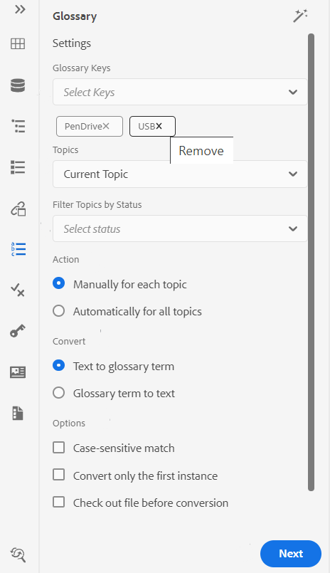{width="300" align="left"}

- **용어 설명 키**: 선택한 항목에서 검색에 사용할 DITA 맵에서 용어집 키를 선택합니다. 선택한 키가 아래에 표시됩니다. 을 클릭하여 선택한 키를 제거할 수 있습니다 **제거** 아이콘.

- **항목**: 다음 중 하나를 선택합니다 **현재 항목** 웹 편집기에서 열어서 **열린 항목** 현재 맵이나 **현재 맵** 맵 편집기에서 편집하여 용어를 검색합니다.
- **상태별 항목 필터링**: 검색을 선택한 문서 상태가 있는 항목으로 제한하도록 선택할 수 있습니다. 항목은 초안, 편집, 인검토, 승인됨, 검토, 완료 상태 또는 조직에서 구성한 상태 중 하나로 설정할 수 있습니다.
- **작업**: 용어집 키를 검색하도록 선택할 수 있습니다 **각 주제에 대해 수동으로** 또는 **모든 항목에 자동**. 만약 **각 주제에 대해 수동으로**&#x200B;를 클릭하면 모든 주제의 각 용어를 전환하기 전에 확인하라는 메시지가 표시됩니다. 만약 **모든 항목에 자동**&#x200B;를 입력하면 모든 주제에 있는 모든 용어가 자동으로 변환됩니다.
- **변환**: 검색된 **텍스트 용어집 용어** 또는 **텍스트 용어집입니다.**
- **옵션**: 다음 옵션 중에서 선택할 수 있습니다.
   - **대/소문자 구분 일치**: 대문자가 같은 일치 항목을 찾을 용어를 검색합니다. 예를 들어 &#39;USB&#39;는 &#39;usb&#39;와 일치하지 않습니다.
   - **첫 번째 인스턴스만 변환**: 검색된 용어의 여러 인스턴스가 주제에 있는 경우 첫 번째 인스턴스만 변환됩니다.
   - **변환 전 파일 체크 아웃**: 검색어를 변환하기 전에 검색된 파일을 체크 아웃합니다.
   - **전환 후 새 버전 만들기**: 용어 변환이 완료되면 항목의 새 버전이 만들어집니다.
- **다음** 을 선택하면 버튼이 나타납니다 **각 주제에 대해 수동으로** 선택 사항입니다. 클릭 **다음** 를 클릭하여 선택된 설정에 따라 각 주제에 대한 용어를 변환합니다. 각 주제의 용어를 변환하라는 메시지가 나타나고 다음 파일로 이동합니다. 용어를 변환하거나 건너뛰고 다음 용어로 이동할 수 있습니다.

   {width="300" align="left"}

- **변환** 을 선택하면 버튼이 나타납니다 **모든 항목에 자동** 선택 사항입니다. 선택 **변환** 문서에 있는 모든 용어를 연결된 용어집으로 변환하는 데 사용됩니다.

목록 **업데이트된 항목** 변환된 용어와 **오류가 있는 항목** 이 표시됩니다. 마우스를 \( \) 아이콘을 클릭하면 오류가 있는 항목 옆에 표시됩니다.

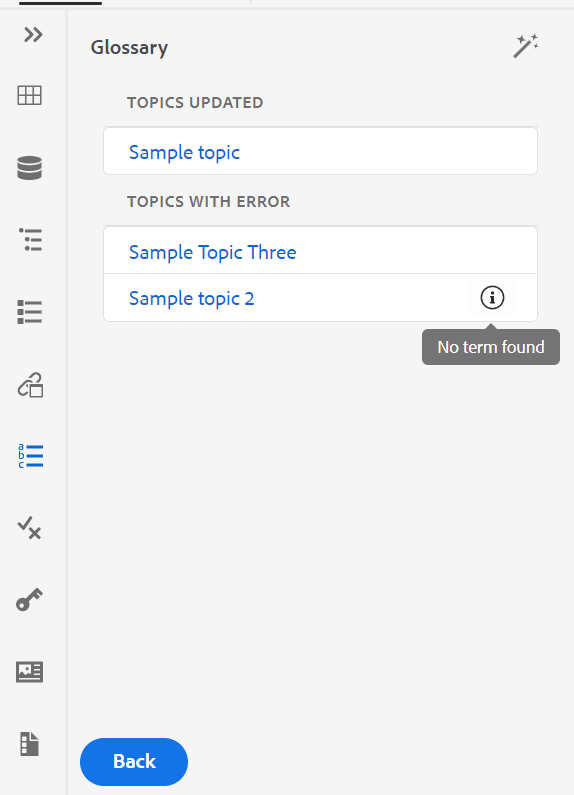{width="300" align="left"}

>[!NOTE]
>
> 주제를 새로 고쳐 변환된 용어를 봅니다.

**조건** -  

조건 패널에는 전역 또는 폴더 수준 프로필에서 관리자가 정의한 조건부 속성이 표시됩니다. 원하는 조건을 컨텐츠에 끌어다 놓아 컨텐츠에 조건을 추가할 수 있습니다. 조건부 콘텐츠는 쉽게 식별할 수 있도록 조건에 정의된 색상을 사용하여 강조 표시됩니다.

요소에 여러 조건을 끌어다 놓아 요소에 여러 조건을 적용할 수도 있습니다. 요소에 여러 조건을 적용하면 속성 패널에 적용된 조건이 쉼표로 구분됩니다.

{width="800" align="left"}

하지만 코드 보기에서는 조건이 공백 구분 기호를 사용하여 구분됩니다. 코드 보기에서 조건을 추가하거나 편집할 때 공백을 사용하여 여러 조건이 구분되도록 합니다.

>[!IMPORTANT]
>
> 다음 스크린샷은 관리 권한이 있는 사용자에 대한 것입니다. 관리 권한이 있는 사용자는 조건을 추가, 편집 및 삭제할 수 있습니다. 그렇지 않으면 일반 작성자로서 조건을 적용하는 선택 사항만 제공됩니다.

{width="800" align="left"}

조건을 추가하거나 정의하려면 조건 패널 옆에 있는 + 아이콘을 클릭하여 조건 정의 대화 상자를 표시합니다.

{width="400" align="left"}

속성 목록에서 정의하려는 조건부 속성을 선택하고 조건에 대한 값을 입력한 다음 조건 패널에 표시되는 레이블을 지정합니다. 조건에 대한 색상을 정의할 수도 있습니다. 이 색상은 조건이 적용되는 컨텐츠의 배경색으로 설정됩니다

조건을 편집하려면 **편집** 옵션 메뉴에서 을 클릭합니다. 조건 편집 대화 상자가 나타납니다.

{width="400" align="left"}

새 조건을 정의할 때 구성된 것과 같은 방식으로 세부 사항을 지정합니다.

**주제 체계** -  

주제 체계 맵은 분류 주제 및 제어 값을 정의하는 데 사용되는 DITA 맵의 전문적인 형태입니다. 요구 사항에 따라 제목 체계 맵을 만들어 루트 맵 파일 내에서 참조할 수 있습니다. AEM 가이드를 사용하면 제목 구성표에서 제목 정의의 중첩 수준 계층을 정의할 수 있습니다.

주제 체계 맵에서 주제 체계를 쉽게 만든 다음 사용할 수 있습니다. 이 맵이 루트 맵으로 추가되면 제목 구성표가 제목 구성표 패널에 표시됩니다. 제목 체계 패널에는 사용 가능한 제목 체계가 중첩된 방식이나 계층적 방식으로 표시됩니다.

AEM 가이드는 중첩된 수준 제목 체계 맵을 지원하며 루트 제목 체계 맵에서 여러 제목 체계를 정의할 수 있습니다.

다음 예제는 AEM 안내서에서 제목 스키마를 사용하는 방법을 보여줍니다.

1. 선택한 도구에서 제목 체계 파일을 만듭니다. 다음 XML 코드는 `platform` 속성을 사용합니다.

   ```XML
   <?xml version="1.0" encoding="UTF-8"?>
   <!DOCTYPE subjectScheme PUBLIC "-//OASIS//DTD DITA Subject Scheme Map//EN" "subjectScheme.dtd">
   <subjectScheme id="GUID-4f942f63-9a20-4355-999f-eab7c6273270">
       <title>rw</title>
       <!-- Define new OS values that are merged with those in the unixOS scheme -->
       <subjectdef keys="os">
           <subjectdef keys="linux">    </subjectdef>
           <subjectdef keys="mswin">    </subjectdef>
           <subjectdef keys="zos">    </subjectdef>
       </subjectdef>
       <!-- Define application values -->
       <subjectdef keys="app" navtitle="Applications">
           <subjectdef keys="apacheserv">    </subjectdef>
           <subjectdef keys="mysql">    </subjectdef>
       </subjectdef>
       <!-- Define an enumeration of the platform attribute, equal to       each value in the OS subject. This makes the following values       valid for the platform attribute: linux, mswin, zos -->
       <enumerationdef>
           <attributedef name="platform">    </attributedef>
           <subjectdef keyref="os">    </subjectdef>
       </enumerationdef>
       <!-- Define an enumeration of the otherprops attribute, equal to       each value in the application subjects.       This makes the following values valid for the otherprops attribute:       apacheserv, mysql -->
       <enumerationdef>
           <attributedef name="otherprops">    </attributedef>
           <subjectdef keyref="app">    </subjectdef>
       </enumerationdef>
   </subjectScheme>
   ```

   {width="300" align="left"}

1. 파일을 .ditamap 확장자로 저장하고 DAM의 모든 폴더에 업로드합니다.

   >[!NOTE]
   >
   > 상위 DITA 맵에서 제목 체계 파일에 참조를 추가할 수 있습니다.

   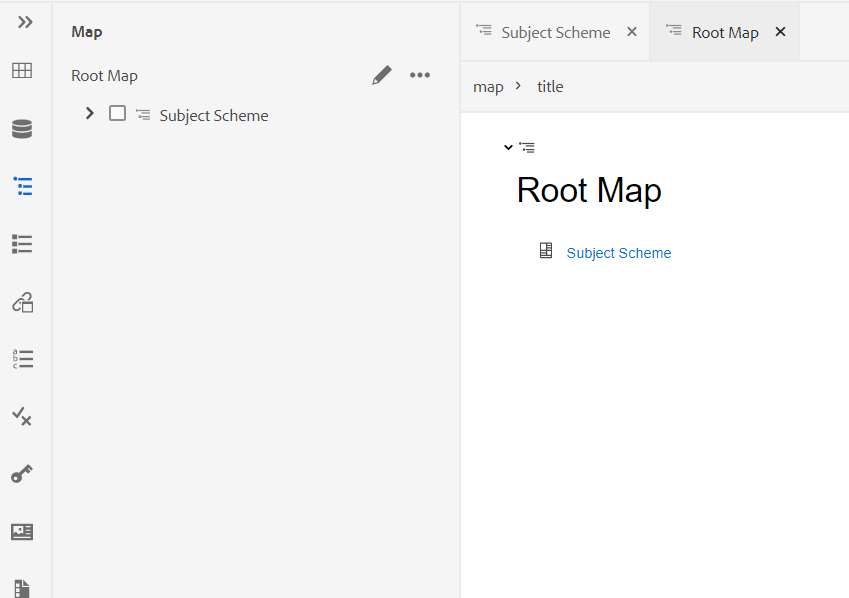{width="550" align="left"}

1. 상위 맵을 **사용자 환경 설정**. 이 맵이 루트 맵으로 추가되면 제목 구성표가 제목 구성표 패널에 표시됩니다.

   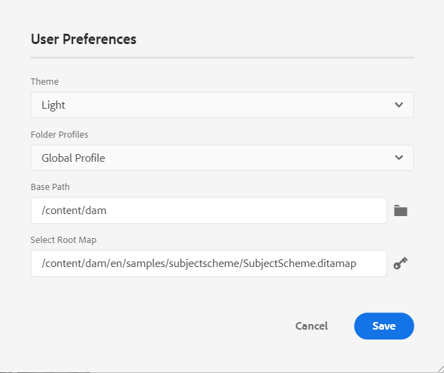{width="400" align="left"}

1. 웹 편집기에서 제목 체계 정의를 사용할 파일을 엽니다.
1. 원하는 제목 스키마를 콘텐츠에 끌어다 놓아 컨텐츠에 제목 체계를 적용합니다. 그러면 컨텐츠가 정의된 색상으로 강조 표시됩니다.

   {width="650" align="left"}


**속성 드롭다운**

작성자 보기의 컨텐츠 속성 패널에서 속성 드롭다운을 사용하여 제목 구성표의 값을 변경할 수도 있습니다. 값을 변경하려면 속성 드롭다운에서 값을 선택합니다.

{width="300" align="left"}

드롭다운에서 여러 값을 선택하여 속성에 대한 값을 적용할 수도 있습니다.

**소스 보기**

소스 보기에서 속성의 드롭다운에서 값을 변경할 수도 있습니다. 소스 보기에서는 잘못된 값을 추가할 수도 없습니다.

{width="550" align="left"}

**조건 패널에서 제목 체계를 보고 적용합니다**

조건 패널에서 제목 체계를 보고 적용할 수도 있습니다.

조건 패널에서 제목 체계를 보려면 시스템 관리자가 옵션을 선택해야 합니다 **조건 패널에 제목 체계 표시** 편집기 설정의 조건 탭에서 다음을 수행합니다. 자세한 내용은 다음을 참조하십시오. [조건 탭](#id21BMNE0602V).

조건(Conditions) 패널에는 제목 구성표 내의 제목 정의의 플랫 수직 구조가 표시됩니다.

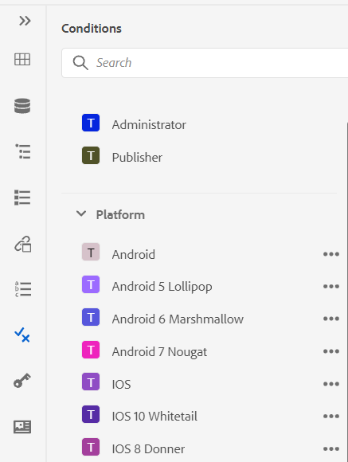{width="300" align="left"}

원하는 조건을 컨텐츠에 끌어다 놓아 컨텐츠에 조건을 추가할 수 있습니다. 조건에 대해 정의된 색상을 사용하여 조건부 콘텐츠가 강조 표시됩니다.

**코드 조각** -  

코드 조각은 설명서 프로젝트의 다양한 항목에서 다시 사용할 수 있는 작은 컨텐츠 조각입니다. 코드 조각 패널에는 사용자가 만든 컨텐츠 조각 컬렉션이 표시됩니다. 코드 조각을 삽입하려면 패널에서 주제의 원하는 위치로 코드 조각을 드래그하여 놓습니다. 코드 조각 패널을 사용하면 코드 조각을 추가, 편집, 삭제, 미리 보기 및 삽입할 수 있습니다.

>[!IMPORTANT]
>
> 다음 스크린샷은 관리 권한이 있는 사용자에 대한 것입니다. 관리 권한이 있는 사용자는 코드 조각을 추가, 편집 및 삭제할 수 있습니다. 그렇지 않으면 일반 작성자로서 코드 조각을 미리 보고 삽입할 수 있는 옵션만 제공됩니다.

{width="400" align="left"}

코드 조각을 추가하려면 다음 방법 중 하나를 사용하십시오.

- 코드 조각 옆에 있는 + 아이콘을 클릭하여 새 코드 조각 대화 상자를 엽니다.

   {width="550" align="left"}

   새 코드 조각 대화 상자에서 만들려는 코드 조각 컨텐츠의 코드 조각 패널, 설명 및 XML 코드에 나타나는 제목을 제공합니다. 클릭 **만들기** 코드 조각을 저장하고 만들려면

- 컨텐츠 편집 영역에서 코드 조각으로 사용할 요소의 탐색 표시를 마우스 오른쪽 단추로 클릭하고 를 선택합니다 **코드 조각 만들기** 컨텍스트 메뉴에서 을 클릭합니다. 새 코드 조각 대화 상자는 **컨텐츠** 필드. 을(를) 입력합니다. **제목** 및 **설명** 코드 조각에 대해 를 클릭하고 **만들기** 코드 조각을 저장하려면

- 컨텐츠 편집 영역에서 코드 조각으로 사용할 컨텐츠의 아무 곳이나 마우스 오른쪽 단추로 클릭하고 를 선택합니다 **코드 조각 만들기** 컨텍스트 메뉴에서 을 클릭합니다. 새 코드 조각 대화 상자는 **컨텐츠** 필드. 을(를) 입력합니다. **제목** 및 **설명** 코드 조각에 대해 를 클릭하고 **만들기** 코드 조각을 저장하려면

   다음 스크린샷에서는 컨텍스트 메뉴를 호출할 수 있는 이동 경로 및 컨텐츠 영역을 강조 표시합니다.

   {width="350" align="left"}


코드 조각을 삽입하려면 다음 방법 중 하나를 사용하십시오.

- 코드 조각 패널에서 코드 조각을 선택하고 주제의 원하는 위치에 코드 조각을 드래그하여 놓습니다.

- 필요한 코드 조각의 옵션 메뉴에서 코드 조각을 삽입할 위치에 삽입 포인터를 놓습니다.


>[!NOTE]
>
> 코드 조각 항목의 컨텍스트 메뉴에서 편집, 삭제, 미리 보기 또는 코드 조각 삽입을 선택할 수도 있습니다.

**템플릿** -  

템플릿 패널은 관리자만 사용할 수 있습니다. 이 패널을 사용하면 작성자가 사용할 수 있는 템플릿을 관리자가 쉽게 만들고 관리할 수 있습니다. 기본적으로 템플릿은 다음과 같이 분류됩니다. *맵* 및 *주제* 유형 템플릿.

{width="550" align="left"}

템플릿을 만들려면 템플릿 옆에 있는 + 아이콘을 클릭하고 만들 템플릿을 선택합니다. 선택하는 경우 **항목 템플릿**&#x200B;새 주제 템플릿 만들기 대화 상자가 나타납니다.

{width="400" align="left"}

만들 템플릿 유형을 **템플릿** 드롭다운 목록. 다음을 제공합니다. **제목**- 템플릿 패널에 표시됩니다. 다음 **이름** 템플릿의 자동 제안은 제목을 기준으로 하지만, 다른 파일 이름을 제공할 수 있습니다.

>[!NOTE]
>
> 관리자가 UUID 설정을 기반으로 자동 파일 이름을 활성화한 경우에는 이름 필드가 표시되지 않습니다.

템플릿이 생성되면 전역 또는 폴더 수준 프로필에 추가해야 합니다. 템플릿이 추가되면 작성자가 주제/맵 작성 프로세스에서 새 템플릿을 보기 시작합니다.

기존 템플릿의 옵션 메뉴를 사용하여 **편집** 또는 **복제** 그래 중복되는 경우 템플릿의 구조 및 유형 \(document\)가 유지되어 다시 사용하여 다른 템플릿을 만들 수 있습니다.

**찾기 및 바꾸기** -  

찾기 및 바꾸기 아이콘은 왼쪽 패널 하단에 있습니다. 찾기 및 바꾸기 패널을 사용하면 맵 또는 리포지토리 내의 폴더에서 텍스트를 검색하고 바꿀 수 있습니다. 맵 내의 하위 맵에 있는 항목은 물론 맵의 모든 주제와 함께 찾아서 바꿀 수 있습니다.

{width="800" align="left"}

전역 검색 및 바꾸기를 수행하려면 다음 단계를 수행하십시오.

1. 전역 열기 **찾기 및 바꾸기** 패널.
1. 을(를) 클릭합니다. **살펴보기** 드롭다운에서 다음 옵션 중 하나를 선택하여 검색을 수행합니다.
   - **현재 맵**: 현재 열려 있는 맵에서 검색하려면

      >[!NOTE]
      >
      > 이 옵션은 편집을 위해 맵을 이미 연 경우 나타납니다.

   - **경로**: 선택한 경로를 검색하려면
   - **맵 선택**: 선택한 맵에서 검색하려면

1. 을(를) 클릭합니다. **옵션** 드롭다운을 선택하고 다음 옵션 중에서 선택합니다.

   - **바꾸기 전 체크 아웃 파일**: 검색어를 바꾸기 전에 파일을 자동으로 체크 아웃하려면 이 옵션을 선택합니다. 이 설정은 관리자가 편집하기 전에 파일을 체크 아웃하도록 구성한 경우에 보다 관련이 있습니다. 백엔드 설정이 활성화되면 이 옵션을 선택해야 합니다. 변경하기 전에 파일 체크 아웃 대화 상자에서 모든 파일을 체크 아웃하라는 메시지를 표시하지 않습니다. 이 옵션을 선택하지 않으면 편집을 위해 파일을 열기 전에 프롬프트가 나타납니다.
   - **단어 단위로**: 전체 검색 문자열을 검색하려면 이 옵션을 선택합니다. 예를 들어 검색 문자열에 를 입력하면 검색 결과에 over 및 overview와 같은 단어가 포함된 모든 파일이 반환됩니다. 입력한 정확한 용어를 반환하도록 검색을 제한하려면 이 옵션을 선택합니다.
   - **바꾸기 후 새 버전 만들기**: 텍스트를 바꾸도록 선택한 항목의 새 버전을 만들려면 이 옵션을 선택합니다. 업데이트된 각 파일에 추가할 버전 주석을 제공할 수도 있습니다.

      이 옵션을 선택하지 않으면 변경 내용이 항목의 현재 버전에 저장되고 새 버전이 만들어지지 않습니다.

   - **간접 참조 포함**: DITA 맵 내의 간접 참조에서도 문자열을 검색하려면 이 옵션을 선택합니다. 기본적으로 비활성화되므로 직접 참조에서만 검색이 수행됩니다.

1. 찾을 검색어 또는 텍스트를 입력합니다.
1. 검색어를 바꿀 텍스트를 입력합니다.
1. Enter 키를 누르거나 선택합니다 **검색** 아이콘 \( \)을 입력하여 검색을 수행합니다.
1. 검색 결과 목록에서 파일을 선택합니다. 콘텐츠 편집 영역에서 파일이 열리고 검색된 용어가 컨텐츠에 강조 표시됩니다.
1. 전역 열기 **찾기 및 바꾸기** 패널.
1. 을(를) 클릭합니다. **살펴보기** 드롭다운에서 다음 옵션 중 하나를 선택하여 검색을 수행합니다.

   - **현재 맵**: 현재 열려 있는 맵에서 검색하려면

      >[!NOTE]
      >
      > 이 옵션은 편집을 위해 맵을 이미 연 경우 나타납니다.

   - **경로**: 선택한 경로를 검색하려면
   - **맵 선택**: 선택한 맵에서 검색하려면

1. 을(를) 클릭합니다. **옵션** 드롭다운을 선택하고 다음 옵션 중에서 선택합니다.

   - **바꾸기 전 체크 아웃 파일**: 검색어를 바꾸기 전에 파일을 자동으로 체크 아웃하려면 이 옵션을 선택합니다. 이 설정은 관리자가 편집하기 전에 파일을 체크 아웃하도록 구성한 경우에 보다 관련이 있습니다. 백엔드 설정이 활성화되면 이 옵션을 선택해야 합니다. 변경하기 전에 파일 체크 아웃 대화 상자에서 모든 파일을 체크 아웃하라는 메시지를 표시하지 않습니다. 이 옵션을 선택하지 않으면 편집을 위해 파일을 열기 전에 프롬프트가 나타납니다.

   - **단어 단위로**: 전체 검색 문자열을 검색하려면 이 옵션을 선택합니다. 예를 들어 검색 문자열에 를 입력하면 검색 결과에 over 및 overview와 같은 단어가 포함된 모든 파일이 반환됩니다. 입력한 정확한 용어를 반환하도록 검색을 제한하려면 이 옵션을 선택합니다.

   - **바꾸기 후 새 버전 만들기**: 텍스트를 바꾸도록 선택한 항목의 새 버전을 만들려면 이 옵션을 선택합니다. 업데이트된 각 파일에 추가할 버전 주석을 제공할 수도 있습니다.

      이 옵션을 선택하지 않으면 변경 내용이 항목의 현재 버전에 저장되고 새 버전이 만들어지지 않습니다.

   - **간접 참조 포함**: DITA 맵 내의 간접 참조에서도 문자열을 검색하려면 이 옵션을 선택합니다. 기본적으로 비활성화되므로 직접 참조에서만 검색이 수행됩니다.

1. 찾을 검색어 또는 텍스트를 입력합니다.

1. 검색어를 바꿀 텍스트를 입력합니다.

1. Enter 키를 누르거나 선택합니다 **검색** 아이콘 \( \)을 입력하여 검색을 수행합니다.
1. 검색 결과 목록에서 파일을 선택합니다. 콘텐츠 편집 영역에서 파일이 열리고 검색된 용어가 컨텐츠에 강조 표시됩니다.

1. 클릭 **단일 항목 바꾸기** \( \) 항목의 현재 강조 표시된 검색어를 바꾸거나 다음 일치 를 클릭합니다  또는  이전 일치 : 텍스트의 다음 항목 또는 이전 항목으로 이동합니다.

1. 클릭 **파일에서 모두 바꾸기** \( \)을(를) 클릭하여 한 파일에서 검색한 용어의 모든 항목을 한 번의 클릭으로 바꾸기 용어로 바꿀 수 있습니다. 선택한 파일에서 모든 항목을 교체한 후 알림이 표시됩니다.

   >[!NOTE]
   >
   > 검색 결과 목록에서 파일을 마우스로 가리키면 파일의 오른쪽에 있는 파일에서 모두 바꾸기 아이콘을 볼 수 있습니다. 파일 무시 아이콘을 사용하여 검색 결과에서 파일을 제거할 수도 있습니다. 무시하는 파일은 목록에서 제거되고 검색된 용어가 대체되지 않습니다.

1. 클릭 **모두 바꾸기** \( \) 목록의 맨 위에 있는 오른쪽의 를 클릭하여 모든 파일에서 검색한 용어의 모든 항목을 한 번의 클릭으로 대체 용어로 바꿉니다.

   >[!NOTE]
   >
   > 를 사용하려면 **모두 바꾸기** 아이콘, 시스템 관리자가 옵션을 선택해야 합니다. **모두 바꾸기 활성화** 아래에 **일반** 탭 **편집기 설정**.


전체 시스템에서 한 번에 하나의 바꾸기 작업만 수행할 수 있으며, 시간 작업이 수행될 때까지 &quot;진행 중인 모든 바꾸기&quot; 상태가 표시됩니다. 에서 모든 바꾸기 작업을 중단하거나 로그 보고서를 볼 수도 있습니다. 작업을 중단하면 받은 편지함에서 해당 작업에 대한 알림을 받게 됩니다. 선택한 파일에서 모든 항목을 교체한 후 성공 알림이 표시됩니다.

{width="400" align="left"}

를 사용할 수도 있습니다 **맵에서 찾기** 옵션 **옵션** 맵에서 텍스트를 찾아 바꿀 지도 메뉴입니다. 이 옵션은 저장소 패널이나 맵 보기에서 연 맵에 대해 나타납니다.

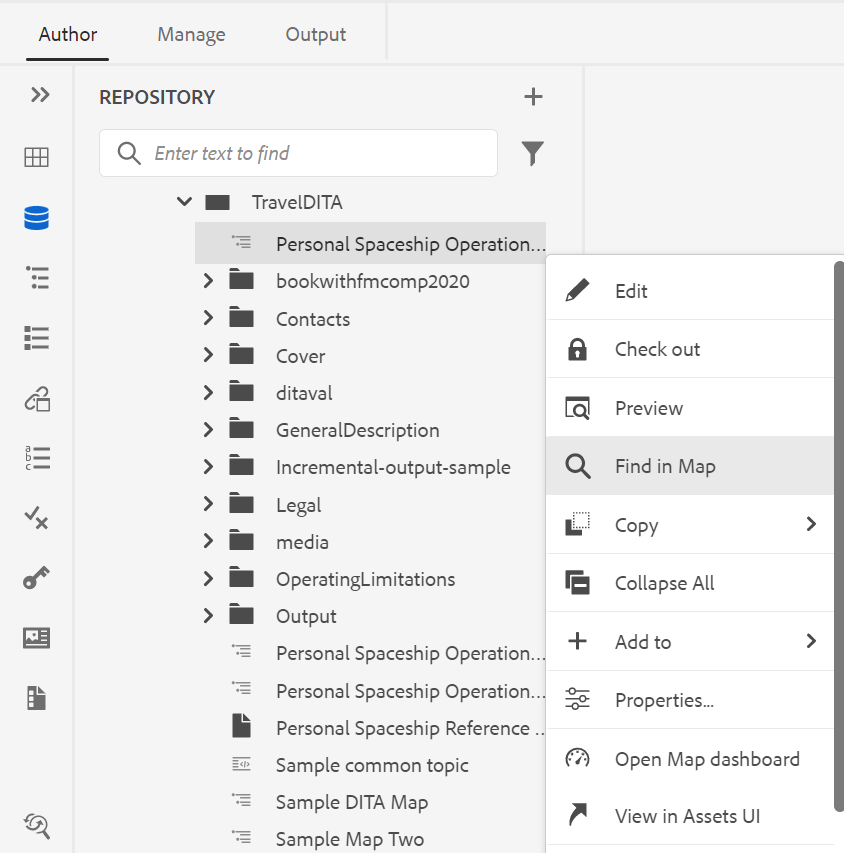{width="550" align="left"}

## 콘텐츠 편집 영역 {#id2051EB000UI}

컨텐츠 편집 영역은 주제 또는 맵의 컨텐츠가 표시되는 위치입니다. 이 영역에서 모든 컨텐츠를 편집할 수 있습니다. 편집 중인 컨텐츠에 대한 WYSIWYG 보기가 제공됩니다. 여러 항목을 동시에 열 수 있으며, 각 탭에 표시됩니다. 파일의 탭 아래에는 현재 커서 위치에 요소의 이동 경로가 있습니다. 컨텐츠 편집 영역의 오른쪽 위 모서리에는 현재 항목의 버전 번호가 표시됩니다.

{width="650" align="left"}

## 오른쪽 패널 {#id2051EB003YK}

오른쪽 패널은 현재 선택한 문서에 대한 정보가 포함된 영구 패널입니다.

>[!NOTE]
>
> 오른쪽 패널의 크기를 조정할 수 있습니다. 패널 크기를 조정하려면 패널 경계에 커서를 놓으면 커서가 양방향 화살표로 바뀌고 클릭한 후 드래그하여 패널 너비의 크기를 조정합니다.

오른쪽 패널에서 다음 기능에 액세스할 수 있습니다.

**컨텐츠 속성** -  

오른쪽 패널에서 컨텐츠 속성 아이콘을 클릭하여 컨텐츠 속성 기능에 액세스할 수 있습니다. 컨텐트 속성 패널에는 문서에서 현재 선택한 요소의 유형과 해당 속성에 대한 정보가 포함되어 있습니다. 드롭다운 목록에서 속성을 선택하고 속성 값을 지정하여 속성을 추가할 수도 있습니다.

>[!NOTE]
>
> 주제에 참조된 컨텐츠가 포함되어 있어도 속성 패널을 사용하여 속성에 속성을 추가할 수 있습니다.

관리자가 속성에 대한 프로필을 생성한 경우, 해당 속성이 구성된 값과 함께 제공됩니다. 컨텐츠 속성 패널을 사용하여 이러한 속성을 선택하고 주제의 관련 컨텐츠에 할당할 수 있습니다. 이러한 방식으로 조건부 컨텐츠를 만들 수도 있으며 조건부 출력을 만드는 데 사용할 수 있습니다. 조건부 사전 설정을 사용하여 출력을 생성하는 방법에 대한 자세한 내용은 [조건 사전 설정 사용](generate-output-use-condition-presets.md#).

{width="300" align="left"}

**파일 속성** -  

오른쪽 패널에서 파일 속성 아이콘을 클릭하여 선택한 파일의 속성을 봅니다. 파일 속성에는 다음 두 섹션이 있습니다.

**일반**

일반 섹션에서는 다음 기능에 액세스할 수 있습니다.

{width="300" align="left"}

- **이름**: 선택한 항목의 파일 이름을 표시합니다. 파일 이름이 선택한 파일의 속성 페이지에 하이퍼링크됩니다.
- **ID**: 선택한 항목의 ID를 표시합니다.
- **메타데이터 태그**: 다음은 항목의 메타데이터 태그입니다. 속성 페이지의 태그 필드에서 설정됩니다.
- **언어**: 항목의 언어를 표시합니다. 속성 페이지의 언어 필드에서 설정됩니다.
- **만든 날짜**: 항목을 만든 날짜와 시간을 표시합니다.
- **체크 아웃한 사람**: 항목을 체크 아웃한 사용자를 표시합니다.
- **문서 상태**: 현재 열려 있는 항목의 문서 상태를 선택하고 업데이트할 수 있습니다. 자세한 내용은 [문서 상태&#x200B;](web-editor-document-states.md#)*.*

**참고:** 파일 속성의 여러 필드 속성 값을 클립보드에 복사할 수 있습니다.

**참조**

참조 섹션에서는 다음 기능에 액세스할 수 있습니다.

{width="300" align="left"}

- **에 사용됨**: 참조 목록에서 현재 파일을 참조하거나 사용하는 문서가 나열됩니다.
- **나가는 링크:** 발신 링크에는 현재 문서에서 참조하는 문서가 나열됩니다.

마우스를 파일의 참조 위로 가져간 후 도구 설명에 파일의 파일 경로와 UUID를 가져옵니다.

**참고:** 사용된 모든 시작 및 나가는 참조가 문서에 하이퍼링크됩니다. 연결된 문서를 쉽게 열고 편집할 수 있습니다.

파일을 열 뿐만 아니라 **옵션** 참조(References) 섹션의 메뉴. 수행할 수 있는 작업 중 일부에는 편집, 미리 보기, UUID 복사, 경로 복사, 즐겨찾기에 추가, 속성 및 맵 열기 대시보드가 포함됩니다.

**검토** -  

검토(Review) 아이콘을 클릭하면 현재 열려 있는 문서에 대한 검토 작업을 생성할 수 있는 검토 패널이 열립니다.

{width="300" align="left"}

여러 개의 검토 프로젝트를 생성한 경우 드롭다운에서 하나를 선택하고 검토 주석에 액세스할 수 있습니다.

검토 패널을 사용하여 주제에 지정된 주석을 보고 게시할 수 있습니다. 주석을 하나씩 수락하거나 거부할 수 있습니다.

자세한 내용은 [주소 검토 주석](review-address-review-comments.md#).

**추적된 변경 사항** -  

오른쪽 패널의 추적된 변경 내용 기능을 사용하여 문서에서 수행된 모든 업데이트 정보를 볼 수 있습니다. 문서에 대한 특정 업데이트를 검색할 수도 있습니다.

>[!NOTE]
>
> 변경 내용 추적 기능은 기본 도구 모음의 변경 내용 추적 활성화/비활성화 기능을 사용하여 추적된 모든 업데이트를 표시합니다. 자세한 내용은 [변경 내용 추적 활성화/비활성화](#id205DF0203Y4).

**상위 항목:**[&#x200B;웹 편집기 작업](web-editor.md)
