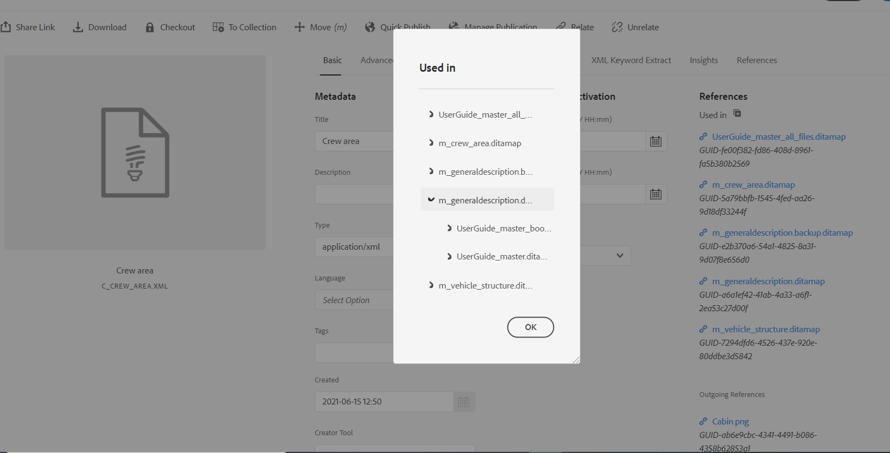
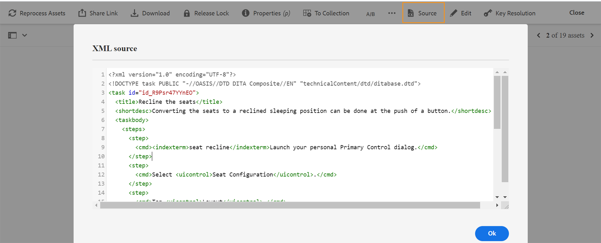

# 주제 미리 보기 {#id1696II000QR}

주제가 만들어지면 AEM Guides에서 주제 미리 보기를 생성합니다. 미리 보기 모드에서는 문서 작업에 사용할 수 있는 다양한 기능을 제공합니다.

항목을 미리 보려면 다음 단계를 수행하십시오.

1. 자산 UI에서 보려는 항목으로 이동합니다.
1. 보려는 항목을 클릭합니다.

   주제 미리 보기가 자산 UI에 표시됩니다.

   >[!NOTE]
   >
   > 주제 파일 탭의 오른쪽 상단 모서리에서 활성 주제 또는 DITA 맵 버전을 볼 수 있습니다.

   >[!IMPORTANT]
   >
   > 미리 보기 도구 모음에서 다음 기능의 위치는 AEM 서버의 설정에 따라 다를 수 있습니다. 일부 기능은 기본 도구 모음에서 사용할 수 있으며, 다른 기능은 추가 메뉴 아래에서 사용할 수 있습니다.

## 미리 보기 모드에서 사용할 수 있는 기능

{width="800" align="left"}

미리 보기 모드의 도구 모음에서 다음 작업을 수행할 수 있습니다.

**속성**

선택한 항목의 등록 정보를 봅니다. AEM 버전을 기준으로 메타데이터, 예약 \(de\)활성화, 참조, 문서 상태 등과 같은 속성을 볼 수 있습니다.

>[!NOTE]
>
> 항목의 제목 속성은 `title` 태그 내에 이미지 요청을 완전히 채우는 데 사용할 수 있습니다. 속성 창을 사용하여 제목을 변경하면 변경된 내용이 손실됩니다. 제목 속성을 업데이트하려면 웹 편집기를 사용하여 이를 수행해야 합니다.

속성 페이지에는 맵이나 주제가 사용되는 위치 또는 문서에 포함된 참조와 같은 참조에 대한 유용한 정보가 포함되어 있습니다. 등록 정보 페이지에는 문서에 대한 두 가지 유형의 참조가 나열됩니다. **에 사용됨** 및 **보내는 참조**.

다음 **에 사용됨** 참조: 현재 파일을 참조하거나 사용하는 문서 목록 다음 **보내는 참조** 현재 문서에서 참조되는 문서를 나열합니다.

의 \(+\) 아이콘 **에 사용됨** 참조 섹션에서는 해당 주제가 사용 중이거나 참조되는 위치를 찾기 위해 위로 더 이동할 수 있습니다.

{width="800" align="left"}

클릭 문서 옆에 있는 아이콘은 해당 문서가 추가 참조되는 맵 또는 주제 파일을 표시합니다.

**조건부 필터링 \(A/B\)**

주제에 조건부 컨텐츠가 있다면 도구 모음에 A/B 아이콘이 표시됩니다. 이 아이콘을 클릭하면 주제의 사용 가능한 조건에 따라 컨텐츠를 필터링할 수 있는 팝업이 열립니다.

>[!NOTE]
>
> 조건부 콘텐츠는 웹 편집기에서 밝은 배경색을 사용하여 강조 표시됩니다.

{width="300" align="left"}

**편집**

- 웹 편집기에서 편집할 항목을 엽니다. 다음 **편집** 관리자가 **체크 아웃 없이 편집 비활성화** 선택 사항입니다. 옵션을 활성화하면 **편집** 옵션 을 선택합니다.

**키 해상도**

- 항목의 키 공간 파일을 사용하려면 키 해상도 아이콘을 클릭합니다. 그런 다음 키 해상도 팝업에서 키 공간을 선택할 수 있습니다.

**소스**

- 파일의 XML 소스 코드를 엽니다. 미리 보기 모드에서 파일을 열고 소스 아이콘을 클릭하여 맵, 주제 또는 DITAVAL 파일의 기본 XML 코드를 볼 수 있습니다. XML 소스 팝업에는 XML 소스 코드가 표시됩니다. 파일에서 특정 코드를 선택하거나 `Ctrl`+`a` 전체 컨텐츠를 선택하려면 다음을 수행하십시오.

   >[!NOTE]
   >
   > DITA 맵 파일의 소스 코드 보기를 가져오려면 자산 UI에서 파일을 선택하고 소스를 클릭합니다.

   {width="800" align="left"}

**UUID 링크 공유**

- AEM 가이드를 사용하면 DITA 맵, 주제 및 이미지 파일에 대한 UUID 기반 링크를 다음 위치에서 공유할 수 있습니다.

   - 자산 UI
   - DITA 맵의 콘솔
   - 주제 또는 이미지의 미리 보기

새로운 옵션 **UUID 링크 공유** 은 위에 언급된 영역의 도구 모음에 표시됩니다. 다음 스크린샷은 **UUID 링크 공유** 항목의 미리 보기 모드에서 옵션:

{width="800" align="left"}

자산 UI에서 파일을 선택하면 이 옵션이 표시됩니다. 미리 보기 모드에서는 기본적으로 기본 도구 모음에서 이 옵션을 사용할 수 있습니다. DITA 맵 콘솔에서 이 옵션은 출력 사전 설정 섹션에 표시됩니다.

URL을 복사하면 다른 사용자와 동일한 URL을 공유하여 해당 파일에 직접 액세스할 수 있습니다. 이 링크는 파일을 리포지토리의 다른 위치로 이동하더라도 유효한 상태로 유지됩니다. 링크가 실패할 유일한 시간은 저장소에서 파일을 삭제할 때입니다.

DITA 맵 콘솔 또는 파일의 미리 보기 모드에서 링크를 공유하면 사용자가 동일한 파일 보기로 이동됩니다. 그러나 자산 UI에서 맵 파일의 링크를 공유하면 사용자가 맵의 콘솔로 이동합니다. 마찬가지로 주제 또는 이미지 파일의 경우 파일의 미리 보기가 표시됩니다.

>[!IMPORTANT]
>
> 링크는 다른 항목에서 참조 링크로 사용할 수 없으며 리포지토리의 파일에 직접 액세스할 수만 있습니다. 또한 저장소에서 파일을 사용할 수 있는 한 링크가 유효한 상태로 유지됩니다. 파일이 리포지토리의 다른 위치로 이동되더라도 링크가 유효한 상태로 유지됩니다. 저장소에서 파일이 삭제되는 경우에만 링크가 실패합니다.

**체크 아웃/체크 인**

- 체크 아웃 및 체크 인 기능을 전환합니다. 파일을 체크 아웃하면 현재 사용자는 파일에 대한 단독 쓰기 권한을 받습니다. 체크 아웃된 파일은 편집을 위해 웹 편집기에서 열 수 있습니다. 필요한 변경 작업을 수행한 후 체크 인 아이콘을 클릭하여 DAM에 파일을 저장합니다.

항목을 체크 아웃하면 파일의 상태가 카드 보기와 목록 보기에서 체크 아웃된 것으로 표시됩니다.

카드 보기에서 파일을 체크 아웃했습니다.

{width="300" align="left"}

목록 보기에서 파일을 체크 아웃했습니다.

{width="550" align="left"}

체크 아웃됨 열이 표시되지 않으면 **설정 보기** 아래에 **목록 보기** 을(를) 선택하고 을(를) 선택합니다. **체크 아웃됨** 의 상태 **열 구성** 대화 상자.

{width="800" align="left"}

>[!TIP]
>
> 파일 체크 아웃 및 체크인 작업에 대한 우수 사례가 필요하면 모범 사례 안내서의 콘텐츠 버전 관리 섹션을 참조하십시오.

**웹 기반 버전 차이점**

- 주제가 일부 변경되었다면 해당 주제의 다른 버전에서 변경된 내용을 쉽게 확인할 수 있습니다. 다른 버전의 주제의 변경 사항을 확인하려면:

   >[!IMPORTANT]
   >
   > 다음 절차에 설명된 메서드는 DITA 파일에만 적용할 수 있습니다. DITA가 아닌 파일의 경우 타임라인 보기를 사용하여 버전을 만들거나 기존 버전의 파일을 복원합니다.

   1. 미리 보기 모드에서 항목을 엽니다.

   1. 왼쪽 레일에서 를 클릭합니다. **버전 기록** 버전을 선택합니다.

      {width="800" align="left"}

   1. 나열된 버전에서 기본 버전으로 사용할 버전을 선택하고 을(를) 클릭합니다 **버전 미리 보기**. 선택한 버전의 미리 보기가 버전 미리 보기 창에 표시됩니다.

   1. 에서 **비교 표시** 목록에서 기본 버전을 비교할 버전을 선택합니다.

      {width="800" align="left"}

      변경된 컨텐츠는 주제 미리 보기에서 강조 표시됩니다. 녹색으로 강조 표시된 컨텐츠는 새로 추가된 컨텐츠를 의미하며 빨간색으로 표시된 컨텐츠는 삭제된 컨텐츠입니다.

      {width="800" align="left"}

### 분기, 되돌리기 및 후속 버전 관리 {#id193PG0Y051X}

- 일반적인 작성 환경에서는 특정 릴리스에 맞게 항목의 새 분기를 만들어야 합니다. 다른 버전 관리 시스템과 마찬가지로 AEM 가이드를 사용하면 기존 버전의 주제에서 분기를 만들거나 이전 버전의 항목으로 되돌릴 수 있습니다. AEM 안내서에서 제공하는 버전 관리 기능을 사용하여 다음 작업을 수행할 수 있습니다.

   - 기존 버전의 주제에서 분기 만들기
   - 새 분기에 후속 버전 만들기
   - 특정 버전의 항목으로 되돌리기

   다음 그림은 일반적인 분기 및 후속 버전 관리 시스템을 보여줍니다.

   {width="550" align="center"}

   새로운 항목의 경우 첫 번째 버전은 1.0으로 번호가 매겨져 있습니다. 그런 다음 항목의 모든 새 버전은 1.1, 1.2 등과 같은 증분 번호로 저장됩니다. 항목의 분기를 만들면 분기를 만들 때 버전 번호를 사용하여 버전 끝에 .0을 추가하는 새 분기가 만들어집니다. 그림에서 보듯이, 항목의 버전 1.1에서 새 분기가 만들어집니다. 새 분기의 버전이 1.1.0으로 지정됩니다. 그런 다음 이 분기에 새 버전의 주제를 저장할 때마다 1.1.1, 1.1.2 등의 증분 버전 번호를 받게 됩니다.

   분기 와 마찬가지로 작업 버전이나 현재 버전을 리포지토리에 있는 버전으로 되돌릴 수도 있습니다. 버전으로 되돌리려면 원하는 버전의 항목을 선택하고 **이 버전으로 되돌리기** 에서 **버전 기록** 패널.

   다음 단계를 수행하여 분기를 만들고, 버전으로 되돌릴 수 있으며, 항목의 후속 버전을 유지 관리합니다.

   >[!IMPORTANT]
   >
   > 다음 절차에 설명된 메서드는 DITA 파일에만 적용할 수 있습니다. DITA가 아닌 파일의 경우 타임라인 보기를 사용하여 버전을 만들거나 기존 버전의 파일을 복원합니다.

   1. 자산 UI의 항목에 액세스합니다.

      >[!NOTE]
      >
      > 미리 보기 모드에서 항목을 열고 3단계로 진행할 수도 있습니다.

   1. 분기를 만들 항목을 선택합니다.

   1. 왼쪽 레일에서 를 클릭합니다. **버전 기록**.

      >[!NOTE]
      >
      > 선택한 항목에 사용할 수 있는 버전 목록이 표시됩니다. 각 버전에는 타임스탬프, 사용자 이름, 버전 설명 및 [레이블](web-editor-use-label.md#) 정보.

   1. 분기를 만들 버전을 선택합니다. 다음 스크린샷에서는 분기를 만들기 위해 버전 1.2가 선택됩니다.

      {width="300" align="left"}

      >[!NOTE]
      >
      > 항목의 현재 버전은 다음과 같습니다 *\(현재\)* 버전 번호 옆에 언급되었습니다.

   1. 클릭 **이 버전으로 되돌리기**.

      새 분기 만들기를 확인하라는 메시지가 나타납니다.

   1. *\(선택 사항\)* 메시지 프롬프트에서 다음을 선택하는 옵션이 제공됩니다 **현재 작업 복사본을 새 버전으로 저장**. 이 옵션의 선택을 기반으로 다음 두 작업을 수행할 수 있습니다.

      - 이 옵션을 선택하면 버전 1.1에서 분기가 만들어집니다. 또한 항목의 현재 작업 복사본에서 새 버전이 만들어져서 다음 버전 - 1.4로 저장됩니다.

         {width="300" align="left"}

         버전 1.2는 항목의 현재 작업 사본이 됩니다. 이 항목 후에 저장된 모든 버전은 1.1의 새 분기 아래에 생성됩니다. 예를 들어 이 분기에 있는 새 항목의 후속 버전은 1.2.0으로 저장됩니다.

         {width="300" align="left"}

      - 이 옵션을 선택하지 않으면 주제의 현재 작업 복사본에서 새 버전이 만들어지지 않습니다. 항목의 버전 1.2에서 새 분기가 만들어집니다. 항목의 후속 버전은 1.2.0, 1.2.1 등으로 1.2 분기 아래에 저장됩니다.

         {width="300" align="left"}
   1. **확인**&#x200B;을 클릭합니다.
   선택한 버전의 주제에서 새 분기가 만들어집니다. 위의 프로세스는 항목의 특정 버전으로 되돌릴 수도 있습니다. 기술적으로 특정 버전으로 되돌리는 것은 선택한 버전에서 새 분기를 만들고 해당 버전을 주제의 현재 작업 사본으로 만드는 것을 의미합니다. 버전 되돌리기 기록 보고서에서 복귀된 파일의 내역을 볼 수도 있습니다. 이 보고서에 대한 자세한 내용은 [파일 버전 기록 보고서를 되돌렸습니다.](reports-reverted-file-version-history.md#).

**상위 항목:**[&#x200B;주제 만들기 및 미리 보기](create-preview-topics.md)

