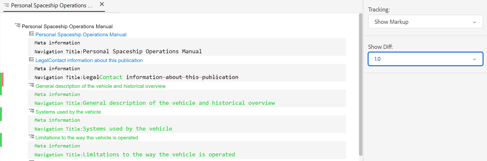

# 웹 편집기 보기 {#id204GK0D0V5Z}

AEM Guides의 웹 편집기에서는 세 가지 다른 모드 또는 보기로 문서 보기를 지원합니다.

## 작성자

일반적인 웹 편집기의 \(WYSISYG\) 보기를 확인할 수 있습니다. 일반적인 리치 텍스트 편집기에서와 마찬가지로 주제를 편집할 수 있습니다. 작성자 보기에서는 문서 개정을 저장하고, 컨텐츠를 찾고 바꾸고, 요소를 삽입하고, 하이퍼링크를 삽입하고, 컨텐츠 참조를 삽입하는 등의 옵션이 있습니다.

>[!NOTE]
>
> 컨텐츠 참조를 사용하면 참조된 컨텐츠가 작성자 보기에도 파란색으로 표시됩니다. 참조한 콘텐츠는 편집할 수 없습니다.

## 소스

소스 뷰는 주제를 구성하는 기본 XML을 표시합니다. XML을 직접 사용하는 데 익숙하다면 [소스] 뷰를 사용해야 합니다. 이 보기에서 일반적인 텍스트를 편집할 수 있을 뿐만 아니라 스마트 카탈로그를 사용하여 요소와 속성을 추가하거나 텍스트, 요소 또는 속성을 찾아 바꿀 수도 있습니다.

- 스마트 카탈로그를 호출하려면 새 요소를 삽입할 요소 태그의 끝에 커서를 놓고 &quot;&lt;&quot;를 입력합니다. 편집기에는 해당 위치에 삽입할 수 있는 모든 유효한 XML 요소의 목록이 표시됩니다. 화살표 키를 사용하여 삽입할 요소를 선택하고 Enter 키를 누릅니다. 닫는 괄호 &quot;\>를 입력하면 요소에 대한 닫기 태그가 자동으로 추가됩니다.

   {width="400" align="left"}

- 소스 보기에서 요소를 쉽게 변경할 수도 있습니다. 예를 들어, `p` 요소 대상 `note`, 그런 다음 `p` 태그는 자동으로 `/note`. 요소를 잘못된 요소로 바꾸면 즉시 유효성 검사 오류가 표시됩니다.

- 요소에 속성을 추가하려면 요소 태그 내에 커서를 놓고 스페이스 바를 누릅니다. 해당 요소에 대한 유효한 속성 목록이 스마트 카탈로그에 표시됩니다. 화살표 키를 사용하여 원하는 요소를 선택하고 Enter 키를 눌러 요소를 삽입합니다. 속성에 대한 값을 지정하려면 등호 \(=\)를 입력하고 편집기는 속성 값을 지정할 수 있는 열림 및 닫는 따옴표 &quot;&quot;를 자동으로 입력합니다.

   {width="350" align="left"}

- [소스] 보기에서는 XML 코드를 표시 가능하고 읽기 쉬운 형식으로 다시 구성하는 [자동 들여쓰기] 옵션이 있습니다. 또한 텍스트를 선택하고 작성자에서 소스로 또는 소스에서 작성자 보기로 전환하는 경우 선택한 텍스트도 다른 보기에서 강조 표시됩니다.
- 소스 뷰의 또 다른 강력한 기능은 문서의 XML 유효성 검사입니다. 잘못된 XML이 포함된 문서를 열면 잘못된 XML에 대한 정보가 있는 [소스] 뷰에 열립니다. 예를 들어 다음 스크린샷에서는 잘못된 XML에 대한 정확한 정보가 [구문 분석 오류] 팝업에 제공됩니다.

   {width="650" align="left"}

   위의 스크린샷에서는 잘못된 XML이 포함된 줄을 가리키는 데 십자 표시가 사용됩니다.

- 찾기 및 바꾸기 기능을 사용하여 소스 보기에서 텍스트, 요소 또는 속성을 검색할 수 있습니다.
자세한 내용은 **찾기 및 바꾸기** 의 기능 설명 [기본 도구 모음](web-editor-features.md#id#id2051EA0G05Z) 섹션을 참조하십시오.

- 소스 뷰는 문서를 빠르게 탐색하고 작업할 수 있는 여러 가지 단축키를 제공합니다. 다음 표에는 지원되는 작업 및 바로 가기 키가 나와 있습니다.

   | 이를 위해 진행되는 작업 | 이 바로 가기 사용 |
   |----------|-----------------|
   | 여러 커서 추가 | **Ctrl**+왼쪽 클릭 |
   | 여러 비연속 텍스트 선택 | **Ctrl**+왼쪽으로 클릭하여 텍스트를 드래그하고 선택합니다 |
   | 줄 사이 및 줄에서 텍스트 선택 | **Alt**+왼쪽으로 클릭하여 텍스트를 드래그하고 선택합니다 |
   | 여러 선택 취소 또는 전체 화면 모드 종료 | **Esc** |
   | 자동 완료 표시 | **Ctrl**+**Space** |
   | 현재 태그의 열기 또는 닫기 태그로 이동합니다 | **Ctrl**+**J** |
   | 현재 태그 및 해당 콘텐츠를 확장하거나 축소합니다 | **Ctrl**+**Q** |
   | 현재 요소 및 해당 컨텐츠를 선택합니다 | **Ctrl**+**L** |
   | 현재 요소 바깥쪽 | **Shift**+**탭** |
   | 현재 요소 및 해당 컨텐츠를 삭제합니다 | **Shift**+**Ctrl**+**K** |
   | 커서를 왼쪽으로 한 단어 이동 | **Alt**+**왼쪽 화살표** |
   | 커서를 오른쪽으로 한 단어 이동 | **Alt**+**오른쪽 화살표** |
   | 커서 위치를 변경하지 않고 한 줄을 위로 스크롤합니다. | **Ctrl**+**위쪽 화살표** |
   | 커서 위치를 변경하지 않고 한 줄을 아래로 스크롤합니다. | **Ctrl**+**아래쪽 화살표** |
   | 전체 화면 전환 | **F11** |
   | 현재 요소 뒤에 새 줄 삽입 | **Ctrl**+**Enter 키** |
   | 현재 요소 앞에 새 줄 삽입 | **Shift**+**Ctrl**+**Enter 키** |
   | 현재 단어의 다음 항목을 찾아 선택합니다 | **Ctrl**+**D** |
   | 현재 요소와 콘텐츠를 한 요소 위로 이동합니다 | **Shift**+**Ctrl**+**위쪽 화살표** |
   | 현재 요소와 콘텐츠를 한 요소 아래로 이동합니다 | **Shift**+**Ctrl**+**아래쪽 화살표** |
   | 주석 태그에 현재 요소를 래핑합니다. | **Ctrl**+**/** |
   | 현재 요소와 해당 콘텐츠를 복제합니다 | **Shift**+**Ctrl**+**D** |
   | 커서 다음에 오는 텍스트를 삭제합니다. 커서가 열려 있는 요소 앞에 있으면 전체 요소가 삭제됩니다. | **Ctrl**+**K**+**K** |
   | 현재 줄의 커서 왼쪽에 있는 텍스트를 삭제합니다. 요소의 닫기 태그 뒤에 커서가 있으면 전체 요소가 삭제됩니다. | **Ctrl**+**K**+**백스페이스** |
   | 현재 텍스트를 대문자로 변환 | **Ctrl**+**K**+**U** |
   | 현재 텍스트를 소문자로 변환 | **Ctrl**+**K**+**L** |
   | 현재 요소를 편집기 가운데로 스크롤합니다. | **Ctrl**+**K**+**C** |
   | 현재 위치 위에 커서를 추가합니다 | **Ctrl**+**Alt**+**위쪽 화살표** |
   | 현재 위치 아래에 커서를 추가합니다 | **Ctrl**+**Alt**+**아래쪽 화살표** |
   | 현재 단어 \(앞으로\)를 재귀적으로 찾습니다. | **Ctrl**+**F3** |
   | 현재 단어 \(뒤 방향\)를 재귀적으로 찾습니다. | **Shift**+**Ctrl**+**F3** |

## 미리보기

미리 보기 모드에서 주제를 열면 사용자가 브라우저에서 볼 때 주제가 표시되는 방식이 표시됩니다. DITA 맵의 경우 맵 내의 모든 주제에 대한 단일 복합 문서가 표시되는 맵의 미리 보기가 표시됩니다.

미리 보기 모드에서는 다음 기능을 사용할 수 있습니다.

- [조건부 필터를 기반으로 콘텐츠 보기](#id2114BI00VXA)
- [변경 내용 추적 마크업 보기](#id2114BJ00CE8)
- [항목을 PDF으로 내보내기](#id2114BL00B5U)

### 조건부 필터를 기반으로 콘텐츠 보기 {#id2114BI00VXA}

주제나 맵에서 조건을 사용한 경우 해당 조건이 필터 패널에 표시됩니다. 기본적으로 모든 조건이 선택되어 있고 전체 컨텐츠가 표시됩니다. 조건을 선택 취소하면 해당 조건이 있는 컨텐츠가 보기에서 제거됩니다. 조건부 콘텐츠를 강조 표시하도록 선택할 수도 있습니다.

다음 이미지는 두 가지 조건을 사용하는 항목을 보여줍니다. `Audience` 및 `Product`. 조건부 콘텐츠는 노란색 배경색으로 강조 표시됩니다.

{width="800" align="left"}

### 변경 내용 추적 마크업 보기 {#id2114BJ00CE8}

문서에 변경 내용 추적 마크업 \(또는 시각적 큐\)이 포함되어 있으면 해당 마크업을 사용하거나 사용하지 않고 문서를 미리 볼 수도 있습니다. 문서를 미리 보는 동안 오른쪽 패널에 [필터 및 추적] 옵션이 포함되어 있습니다.

{width="400" align="left"}

3개 있습니다 **추적** 선택할 수 있는 옵션:

- **마크업 없음**: 이 보기에서는 모든 삽입 및 삭제 작업이 허용되며 문서의 간단한 보기가 표시됩니다. 이 보기에서는 변경 내용 추적 마크업이 표시되지 않습니다.
- **원본**: 이 보기에서는 모든 삽입이 거부되고 모든 삭제 내용이 다시 복원되고 미리 보기가 표시됩니다. 변경 내용 추적 모드를 사용하기 전에 문서의 원래 양식을 얻기만 하면 됩니다.
- **마크업 표시**: 이 보기에서는 삽입 및 삭제된 컨텐츠에 대한 모든 마크업이 표시됩니다.

   다음 이미지는 마크업이 있는 맵 파일의 미리 보기를 보여줍니다.

   {width="800" align="left"}

### 항목을 PDF으로 내보내기 {#id2114BL00B5U}

PDF은 문서 개발 주기의 모든 가능한 단계에서 사용되는 가장 일반적인 출력 형식 중 하나입니다. AEM 안내서에서는 개별 주제 또는 전체 맵 파일의 PDF을 유연하게 생성할 수 있습니다. PDF으로 내보내기 기능을 사용하면 작성자, 게시자 또는 관리자가 개별 주제에 대한 PDF 출력을 쉽게 생성할 수 있습니다. 폴더 수준 프로필에 저장된 DITA-OT 구성을 사용하여 PDF을 생성합니다.

이 기능은 다음과 같은 기능을 지원합니다.

- 항목의 현재 활성 작업 사본의 PDF을 생성합니다.
- DITA-OT 변환 이름과 명령줄 인수를 사용하여 PDF을 생성합니다.
- 생성된 출력을 로컬 시스템에 저장합니다.
- 출력을 생성하기 전에 주제에 사용된 키 및 컨텐츠 참조를 확인합니다.

항목을 PDF으로 내보내려면 다음 단계를 수행합니다.

1. 미리 보기 모드에서 항목을 엽니다.

1. 을(를) 클릭합니다. **PDF으로 내보내기** \(\) 아이콘을 클릭합니다.

   PDF으로 내보내기 대화 상자가 표시됩니다.

   {width="350" align="left"}

1. *\(선택 사항\)* 사용할 DITA-OT 변환 이름과 명령줄 인수를 지정합니다.

1. **다운로드**&#x200B;를 클릭합니다.

   >[!NOTE]
   >
   > 브라우저 구성에서 팝업 창을 활성화했는지 확인합니다. 활성화하지 않으면 PDF이 다운로드되지 않습니다.

   PDF이 생성되고 새 탭에서 열립니다. 또는 로컬 시스템에 PDF을 저장하는 대화 상자가 표시됩니다.

**상위 항목:**[&#x200B;웹 편집기 작업](web-editor.md)

