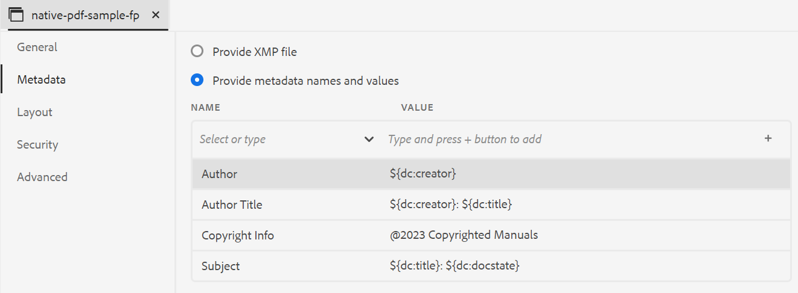

# PDF 출력 게시

AEM 안내서 솔루션을 사용하여 개별 주제 PDF 또는 전체 맵 파일을 생성할 수 있습니다. 아래 세 가지 방법 중 하나를 사용하여 컨텐츠를 PDF 형식으로 게시할 수 있습니다.

* **DITA-OT**

맵 대시보드에서 맵에 대한 PDF 출력을 생성하려면 이 방법을 사용합니다. 맵 대시보드에서 열려 있는 맵의 출력 사전 설정을 만들어 PDF을 생성하기 전에 게시 속성을 설정할 수 있습니다. 출력 사전 설정을 만들거나 편집하려면 *출력 사전 설정 이해* 의 섹션 [AEM 안내서 as a Cloud Service 사용 안내서](https://helpx.adobe.com/content/dam/help/en/xml-documentation-solution/cs-apr-22/XML-Documentation-for-Adobe-Experience-Manager_CS_User-Guide_EN.pdf).

DITA-OT 방법을 사용하여 PDF을 생성하는 방법에 대한 자세한 내용은 다음을 참조하십시오 [DITA-OT를 사용하여 PDF 생성](https://help.adobe.com/en_US/xml-documentation-for-adobe-experience-manager/index.html#t=DXML-master-map%2Fgenerate-output-pdf.html).

* **FrameMaker Publishing Server(FMPS)**

이 방법을 사용하여 DITA 컨텐츠뿐만 아니라 AEM 리포지토리에서 사용할 수 있는 FrameMaker 문서(.book 및 .fm)에서 PDF 출력을 생성합니다. FrameMaker Publishing Server(FMPS)를 사용하여 출력 사전 설정을 구성하고 게시하여 PDF을 만들 수 있습니다. PDF 및 기타 형식에 대한 출력의 모양과 느낌을 디자인 및 구성하고 설정 파일(.sts)에 저장할 수 있습니다. 그런 다음 FMPS에서 이 설정 파일을 사용하여 DITA 맵 또는 .book 파일에 대한 출력을 생성합니다. 출력 사전 설정을 만들거나 편집하려면 다음을 참조하십시오.  *출력 사전 설정 이해* 의 섹션 [AEM 안내서 as a Cloud Service 사용 안내서](https://helpx.adobe.com/content/dam/help/en/xml-documentation-solution/cs-apr-22/XML-Documentation-for-Adobe-Experience-Manager_CS_User-Guide_EN.pdf).

FMPS 구성에 대한 자세한 내용은 [FrameMaker 문서에서 출력 생성](https://help.adobe.com/en_US/xml-documentation-for-adobe-experience-manager/index.html#t=DXML-master-map%2Ffm-output-generatation.html).

* **기본 PDF 게시**

이 방법을 사용하여 W3C CSS3 및 CSS 페이징 미디어 표준을 기반으로 기능이 풍부한 PDF 출력을 생성합니다. 기본 PDF 게시를 사용하면 템플릿을 사용하여 컨텐츠의 레이아웃 및 스타일을 설정하고 다양한 설정을 적용하여 PDF을 세밀하게 조정할 수 있습니다. 또한 템플릿 편집기를 사용하여 나만의 템플릿을 수정하고 만들 수 있습니다.

기본 PDF 게시에 대한 자세한 내용은 [기본 PDF 게시 사용](#native-pdf-publishing).

## 기본 PDF 게시 사용 {#native-pdf-publishing}

컨텐츠를 작성할 때는 컨텐츠가 보기, 편집 및 인쇄에 최적화되도록 해야 합니다. 크기, 여백, 방향, 페이지 나누기, 머리글, 바닥글 및 페이지 번호 지정과 같은 페이지 정의 속성에 대한 W3C CSS3 및 페이지 지정 미디어 표준에 대한 W3C CSS3 등의 표준을 사용하면 일관성과 유용성을 보장하는 PDF 문서에 대한 보기와 레이아웃을 설정할 수 있습니다. 기본 PDF 게시 기능은 이러한 표준을 사용하여 PDF을 생성합니다.

기본 PDF 게시를 사용하면 사전 정의된 템플릿을 사용하여 컨텐츠 레이아웃 및 구조의 일관성을 보장하고, 스타일시트를 적용하여 출력의 모양과 느낌을 변경하고, PDF을 최적화하고, 프린터 표시를 설정하고, 화면 판독기 지원 허용, PDF 적합성 설정, 포함 글꼴 등을 수행할 수 있습니다.

기본 PDF 게시를 사용하여 PDF을 생성하는 두 가지 측면이 있습니다.

* PDF을 세밀하게 조정하려면 템플릿을 사용하여 컨텐츠에 스타일을 적용하고 페이지 레이아웃 및 다양한 설정을 설정합니다. 작성자는 제공된 샘플 템플릿을 사용/수정하거나 사용자 지정 템플릿을 만들고 게시자 및 개발자가 사용하는 고급 구성 옵션을 설정할 수 있습니다.

* PDF 설정을 제어할 PDF 출력 사전 설정을 만들거나 구성합니다. PDF 출력 사전 설정을 만들면 PDF을 생성할 수 있습니다.

자세한 내용은 [PDF 출력 생성](#generate-pdf-output).

## PDF 출력 사전 설정 만들기 {#create-output-preset}

PDF 출력을 생성하는 첫 번째 단계는 맵에 할당된 게시 속성의 컬렉션인 PDF 출력 사전 설정을 만드는 것입니다. 맵 보기 패널에서 열려 있는 모든 맵에 대한 출력 사전 설정을 만들거나, 동일한 맵에 대한 PDF을 빠르게 생성하도록 기존 사전 설정을 구성할 수 있습니다.

PDF 출력 사전 설정에서 템플릿을 선택하고, 조건을 적용하고, 제한을 설정하여 사용자가 PDF과 상호 작용하는 방식을 제어하고, 압축, 적합성 등과 같은 고급 설정을 구성할 수 있습니다.

PDF 출력 사전 설정을 만들거나 구성하려면:

1. 출력 탭에서 **사전 설정** 왼쪽 사이드바
[사전 설정] 패널이 열립니다.
   
2. 출력에서 **사전 설정** 패널에서 다음 중 하나를 수행합니다.
   * 사전 정의된 PDF 출력 사전 설정을 두 번 클릭하여 봅니다.
   * 에 대해 + 아이콘을 클릭합니다. **사전 설정** 새 출력 사전 설정을 추가하려면 **유형: PDF**
3. 기존 PDF 사전 설정의 설정을 구성하려면 다음을 수행하십시오.
   * 을(를) 클릭합니다.  **옵션**  원하는 출력 사전 설정 옆에 있는 아이콘을 선택하고 을(를) 선택합니다 **편집**.
에서는 다음 설정을 사용할 수 있습니다 **일반**, **메타데이터**, **레이아웃**, **보안**, 및 **고급** PDF 출력 사전 설정을 구성하는 탭:

**일반**

출력 경로 지정, PDF 파일 이름 등과 같은 기본 출력 설정을 지정하려면 를 사용하십시오.

| 설정 | 설명 |
| --- | --- |
| **출력 경로** | PDF 출력이 저장되는 AEM 저장소 내의 경로입니다. 출력 경로가 프로젝트 폴더 내에 없는지 확인합니다. 비워 두면 출력이 기본 DITA 맵 출력 위치에 생성됩니다. |
| **PDF 파일** | PDF을 저장할 파일 이름을 지정합니다. 기본적으로 PDF 파일 이름은 사전 설정 이름과 함께 DITA 맵 이름을 추가합니다. 예를 들어 ditamap는 &#39;TestMap&#39;이고 사전 설정의 이름은 &#39;preset1&#39;이면 pdf의 기본 이름은 &#39;TestMap_preset1.pdf&#39;입니다. |
| **을 사용하여 조건 적용** | 조건부 콘텐츠의 경우 아래 옵션 중에서 선택하여 해당 조건을 기반으로 PDF 출력을 생성합니다.  * **적용된 항목 없음** 맵 및 소스 컨텐츠에 조건을 적용하지 않으려면 이 옵션을 선택합니다.   * **Ditaval 파일** 조건부 컨텐츠를 생성하려면 DITAVAL 파일을 선택합니다. 선택하려면 조건 사전 설정에 대해 를 클릭하고 파일을 찾습니다.   * **조건 사전 설정** 출력을 게시하는 동안 조건을 적용하려면 드롭다운에서 조건 사전 설정을 선택합니다. DITA 맵 파일에 조건을 추가한 경우 이 옵션이 표시됩니다. 조건부 설정은 DITA 맵 콘솔의 조건 사전 설정 탭에서 사용할 수 있습니다. 조건 사전 설정에 대한 자세한 내용은 [조건 사전 설정 사용](https://help.adobe.com/en_US/xml-documentation-for-adobe-experience-manager/index.html#t=DXML-master-map%2Fgenerate-output-use-condition-presets.html).   |
| **기준선 사용** | 선택한 DITA 맵에 대한 기준선을 생성한 경우 이 옵션을 선택하여 게시할 버전을 지정합니다. 자세한 내용은 [기준선을 사용한 작업](https://help.adobe.com/en_US/xml-documentation-for-adobe-experience-manager/index.html#t=DXML-master-map%2Fgenerate-output-use-baseline-for-publishing.html) 자세한 내용 |

**메타데이터**

메타데이터는 컨텐츠에 대한 설명 또는 정의입니다. 메타데이터는 컨텐츠 관리에 도움이 되며 인터넷에서 파일을 검색하는 데 도움이 됩니다.

메타데이터 탭을 사용하여 PDF 출력에 대한 제목, 작성자, 제목 및 키워드를 설정합니다. 이 메타데이터는 출력 PDF의 문서 속성 내의 설명 탭에 있는 메타데이터에 매핑됩니다.

**참고**: 이 메타데이터는 책 수준에서 정의된 메타데이터보다 우선합니다.

| 설정 | 설명 |
|---|---|
| **제목** | 문서를 정의하는 짧고 명확한 제목을 지정합니다. |
| **작성자** | 문서를 만든 작성자의 이름을 지정합니다. |
| **제목** | 문서가 관련된 주체 또는 컬렉션을 정의합니다. |
| **키워드** | 관련 키워드를 사용하여 SEO(검색 엔진 최적화)를 향상시키고 사용자가 관련 콘텐츠를 찾을 수 있도록 하십시오. |

**레이아웃**

페이지 레이아웃을 설정하고 페이지 표시 와 같은 PDF 출력에 대한 페이지 보기 옵션을 지정하고 확대/축소 수준을 설정하는 데 사용합니다.

| 설정 | 설명 |
| --- | --- |
| **PDF 템플릿** | PDF 템플릿은 페이지 레이아웃, 컨텐츠 스타일 지정 및 PDF 출력에 다양한 설정을 적용하는 명확한 구조를 제공합니다. PDF 템플릿 드롭다운 옵션 중에서 선택하여 기본 설정 템플릿을 선택합니다. |
| **페이지 표시** | 페이지를 열 때 페이지가 표시되는 방식을 보여주는 페이지 보기에 PDF 표시 을 사용합니다. 페이지 표시 드롭다운 옵션 중에서 선택하여 기본 보기를 선택합니다.  * **기본값**  사용자의 시스템에서 PDF 뷰어의 기본 설정에 따라 을 표시합니다.    * **단일 페이지 보기** 한 번에 한 페이지를 표시합니다.     * **단일 페이지 스크롤** 연속적인 세로 열에 단일 페이지를 표시합니다.    * **두 페이지 보기** 한 번에 두 페이지 스프레드를 나란히 표시합니다. .  * **두 페이지 스크롤** 연속적인 스크롤을 사용하여 두 페이지 스프레드를 나란히 표시합니다. |
| **확대/축소** | 페이지를 열 때 페이지가 표시되는 방식을 보여주는 페이지 보기 크기를 조정하려면 선택합니다.   * **기본값** 사용자의 시스템에서 PDF 뷰어의 기본 설정에 따라 을 표시합니다      * **100%** 페이지를 실제 크기로 표시합니다.       * **페이지 맞추기** 문서 창에 맞게 페이지 너비와 높이를 만듭니다. .  * **페이지 너비에 맞추기** 문서 창의 너비를 페이지 너비로 채웁니다.    * **페이지 높이 맞추기** 페이지 높이를 문서 창의 높이를 채우도록 합니다. |

**보안**

파일을 열고 읽는 데 제한을 추가하여 PDF을 Protect 합니다. 권한 없는 액세스를 방지하려면 아래 옵션을 사용하십시오.

| 설정 | 설명 |
| --- | --- |
| **암호를 설정하여 문서를 엽니다.** | 보안 암호를 추가하여 PDF 파일을 확인합니다. 에서 암호를 지정합니다. **사용자 암호** 필드. 사용자는 이 필드에 제공된 암호를 입력해야 PDF을 열 수 있습니다. |
| **문서 제한 설정** | 사용자가 PDF과 상호 작용하는 방법을 제한하려면 을 선택합니다. 에서 암호를 지정합니다. **소유자 암호** 아래의 제한 설정이 작동하는 필드입니다.   * **인쇄** 사용자가 PDF을 인쇄할 수 있도록 하려면 을(를) 선택합니다.   * **초안 품질 인쇄** 사용자가 PDF을 저해상도로 인쇄하도록 하려면 을(를) 선택합니다.    * **컨텐츠 복사** 사용자가 PDF에서 컨텐츠를 복사할 수 있도록 하려면 을(를) 선택합니다.     * **주석** 사용자가 PDF에 노트나 주석을 추가할 수 있도록 하려면 을(를) 선택합니다.    * **콘텐츠 수정** 사용자가 PDF에서 콘텐츠를 변경할 수 있도록 하려면 을(를) 선택합니다.    * **접근성을 위한 컨텐츠 복사** 화면 판독기에서 PDF의 콘텐츠를 읽고 탐색할 수 있도록 하려면 을(를) 선택합니다.    * **문서 어셈블리** 사용자가 PDF에 페이지를 삽입할 수 있도록 하려면 을 선택합니다.    **참고**: Adobe Acrobat의 파일 > 속성에서 제한을 변경하려면 소유자 암호를 입력해야 합니다. |

**고급**

다음 옵션을 사용하여 PDF 병합을 위한 고급 설정을 지정하고, 압축을 사용하고, 규정 준수 표준 등을 선택합니다.

| 설정 | 설명 |
| --- | --- |
| **액세스 가능(태그가 지정된) PDF 만들기** | 태그가 있는 PDF을 생성하려면 이 옵션을 선택합니다. 태그가 지정된 PDF을 사용하면 화면 판독기에서 컨텐츠, 하이퍼링크, 책갈피 등을 보다 쉽게 읽고 탐색할 수 있습니다. 예를 들어, 표에 태그가 지정되어 있으면 화면 판독기는 줄 및 텍스트뿐만 아니라 표를 읽고 있음을 알 수 있습니다. |
| **목차에 포함된 병합 PDF** | 기존 PDF을 목차에 추가하여 출력에 병합하려면 이 옵션을 선택합니다. PDF이 목차에 표시된 위치에 삽입되고 페이지가 그에 따라 증가합니다. |
| **사용된 글꼴 포함** | 최종 사용자의 컴퓨터에 설치할 수 없는 글꼴을 사용할 경우 이 옵션을 선택합니다. 이 옵션을 선택하면 사용된 글꼴이 PDF에 포함되므로, 글꼴이 시스템에 설치되어 있지 않더라도 사용자가 PDF을 의도한 대로 볼 수 있습니다.   **참고**: 글꼴은 글꼴 공급업체에서 글꼴을 임베드할 수 있는 설정을 포함하는 경우에만 임베드할 수 있습니다. 글꼴을 포함하기 전에 필요한 설정이나 라이센스가 있어야 합니다. |
| **자동 하이픈 넣기 사용** | 자동 하이픈 넣기를 사용하면 줄 끝에 있는 단어가 하이픈으로 맞춤식으로 올바른 위치에 정렬됩니다. |
| **JavaScript 활성화** | PDF을 생성하기 전에 컨텐츠를 동적으로 변환하는 데 사용할 JavaScript 코드가 있는 경우 이 옵션을 활성화합니다. |
| **멀티미디어 파일 포함** | 오디오, 비디오 및 대화형 컨텐츠를 PDF에 포함하려면 이 옵션을 선택합니다. |
| **전체 압축을 사용하여 PDF 크기를 최적화합니다.** | 큰 PDF 크기를 압축/줄이려면 이 옵션을 선택합니다. PDF을 압축하면 파일 품질이 저하될 수 있습니다. |
| **이미지 압축을 사용하여 PDF 크기를 최적화합니다** | PDF에서 사용된 이미지 크기를 압축/줄이려면 이 옵션을 선택합니다. 이미지를 압축하면 이미지 품질이 저하될 수 있습니다. |
| **사용자 정의 해상도(인치당 픽셀 수) 사용** | 인치당 픽셀 단위의 페이지 표시 해상도입니다. 이 옵션을 선택하면 나타나는 필드에 기본 설정 값을 입력합니다. 기본값은 인치당 96픽셀입니다. 값을 낮게 설정하면 더 많은 내용을 1인치 단위로 맞추거나 그 반대로 더 높은 값을 설정합니다. |
| **워터마크 표시** | 콘텐츠에 있는 MathML 방정식을 렌더링하려면 이 옵션을 선택합니다. 그렇지 않으면 방정식은 무시됩니다. |
| **MathML 방정식 사용** | 콘텐츠에 있는 MathML 방정식을 렌더링하려면 이 옵션을 선택합니다. 그 방정식은 기본적으로 무시된다. |
| **PDF 적합성** | PDF을 준수하기 위해를 저장하려는 표준입니다. 드롭다운에서 을(를) 선택하여 사용 가능한 PDF 표준 목록에서 선택합니다. 지원되는 표준에 대한 자세한 내용은 [PDF 표준 기본 정보](https://helpx.adobe.com/acrobat/using/pdf-conversion-settings.html#about_pdf_x_pdf_e_and_pdf_a_standards). |

## PDF 출력 생성 {#generate-pdf-output}

출력 사전 설정을 구성한 후에는 사전 설정 패널에서 **사전 설정 생성** 기능.

1. 아래에 **작성자** 탭에서 을 선택합니다 **저장소** 보기.\
   저장소 패널이 열립니다.

2. 저장소 패널에서 DITA 맵 파일을 엽니다. **맵 보기**.

3. 에서 **출력** 탭, **사전 설정** [사전 설정] 패널을 보려면
출력 사전 설정을 만들거나 구성하려면 다음을 참조하십시오 [PDF 출력 사전 설정 만들기](#create-output-preset).
4. 설정을 저장하려면 **모두 저장**  아이콘 출력 보기에서 표준 도구 모음의 왼쪽 위 모서리에 있는 아이콘을 클릭합니다.
5. 을(를) 클릭합니다. **사전 설정 생성**  상단 막대의 아이콘.
[출력 사전 설정] 패널에서 선택한 출력 사전 설정 옆에 진행률 표시줄을 볼 수 있습니다.
6. 출력 생성이 완료되면 을 클릭합니다  **출력 보기**  상단 막대의 아이콘을 클릭하여 출력을 확인합니다.\
   A **성공** 화면의 오른쪽 아래 모서리에 대화 상자가 표시됩니다.
출력이 성공하지 않으면 아래 오류 메시지가 표시됩니다.
   

오류 로그를 보려면 **해제**&#x200B;를 클릭하고, 선택한 사전 설정 탭 위로 마우스를 가져간 다음 를 클릭합니다.  **옵션** > **로그 보기**.
